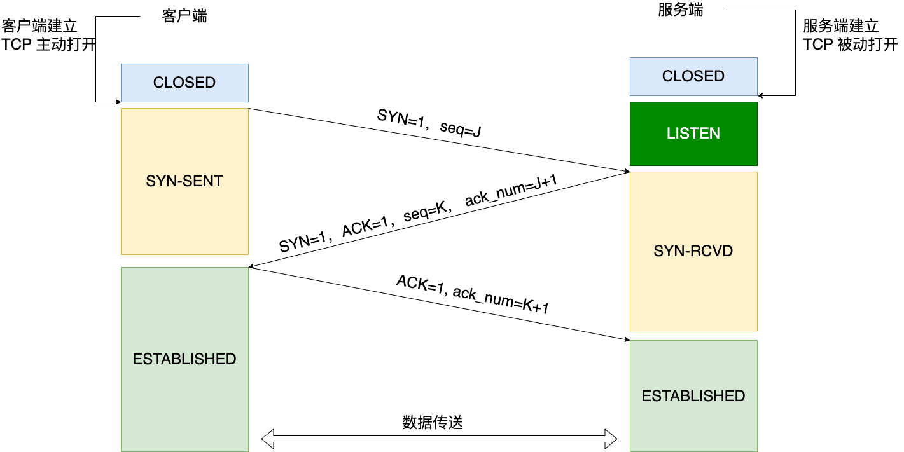
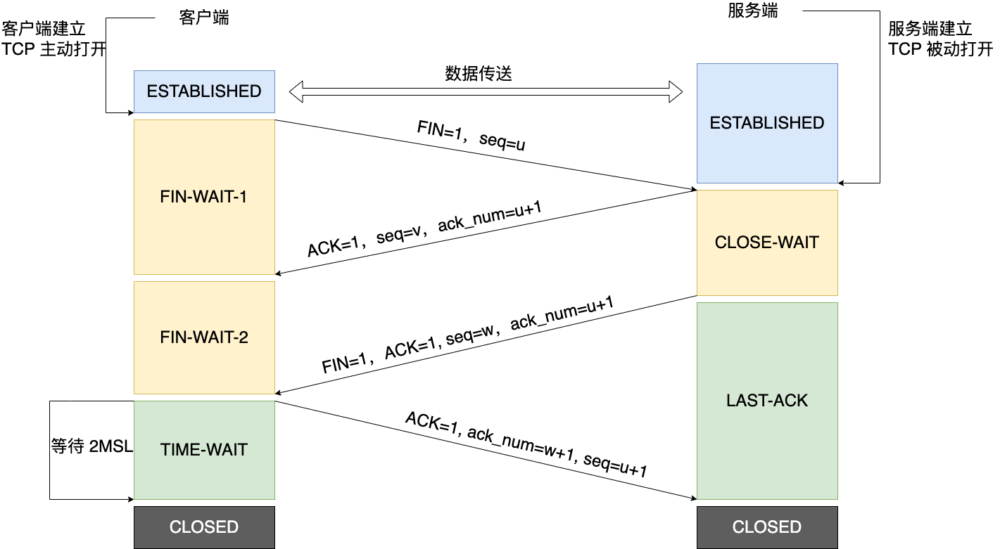

# 网络协议
## 计算机网络
随着计算机技术发展，计算机的体积和价格都在下降，之前计算机多用于研究机构，现阶段逐步进入一般的公司用于办公。原来计算机之间传输数据需要通
过软盘等第三方存储介质进行转存，人们需要将数据直接通过通信线路传输，来缩短传输时间，于是计算机网络开始诞生，并逐渐发展为现在巨大的 Internet。
## 定义和分类
**计算机网络的标准定义是:** 利用通信线路将地理上分散的、具有独立功能的计算机系统 和通信设备按不同的形式连接起来，以功能完善的网络软件及协
议实现资源共享和信息传递的系统。

计算机网络从覆盖范围上划分可以分为三类: 局域网、城域网、广域网
1. 局域网 LAN(作 用范围一般为几米到几十公里);
2. 城域网 MAN(界于 WAN 与 LAN 之间);
3. 广域网 WAN(作用 范围一般为几十到几千公里)
## 计算机网络发展简史
1. 诞生阶段，20 世纪 60 年代中期之前的第一代计算机网络是以单个计算机为中心的 远程联机系统。
2. ARPANET: 多个主机通过通信线路互联起来。它由一个个分散的指挥点组成，当 部分指挥点被摧毁后，其它点仍能正常工作，并且在这些点之间能够绕
过那些已被摧毁的 指挥点而继续保持联系。这个设计出发点很重要，理解了它，就能够理解为何后面要学习 的 TCP 要这么设计。 
3. 开放性的标准化体系结构，OSI 诞生：为了实现网络设备间的互相通讯，ISO 和 IEEE (电气和电子工程师协会，是世界上最大的非营利性专业技术学会)
相继提出了 OSI 参考模 型及其TCP/IP模型。由于TCP/IP尽早地制定了可行性较强的协议，提出了应对技术快速革新的协议，并及时进行后期改良的方案，
因此打败了 OSI 模型，成为了事实上的标准。
4. Internet 互联网：20 世纪 90 年代至今的第四代计算机网络, 就是我们所熟知的 Internet 互联网。

# 网络模型
## OSI 七层模型
OSI 采用了分层的结构化技术，共分七层，物理层、数据链路层、网络层、传输层、会话层、表示层、应用层。如图：

## TCP/IP 模型
OSI 模型比较复杂且学术化，所以我们实际使用的 TCP/IP 模型，分 5 层，物理层、数据 链路层(也有 TCP/IP 模型将物理层、数据链路层合称为网络
接口层，与之对应的，协议就被称为 TCP/IP 四层协议模型)、网络层、传输层、应用层。两个模型之间的对应关系如图 所示:

## TCP/IP 协议族
Transmission Control Protocol/Internet Protocol 的简写，中译名为传输控制协议/因特网 互联协议，是 Internet 最基本的协议、Internet 
国际互联网络的基础。TCP/IP 由很多个协议组成，并且是在不同的层，互联网的基础通信架构。

## IP、TCP 和 UDP
在上述图形中，网际协议 IP 是 TCP/IP 中非常重要的协议，往往用来确定网络中唯一的 一台计算设备，它的作用就好比我们现实生活中的电话号码或者
或者通讯地址。所以这层负责对数据加上 IP 地址(有发送它的主机的地址(源地址)和接收它的主机的地址(目的地址))和其他的数据以确定传输的目标。

1. TCP: 类似于我们日常生活中的打电话，电话接通后通过“喂”确认对方身份，听不 清会要求对方重说，对方说的太快了会要求对方说慢点，讲完了各说一句“再见”结束通话.
因此 TCP 提供了一种可靠的数据传输服务；
2. UDP：UDP 是把数据直接发出去，而不管对方是不是在接收，也不管对方是否能接收的了，也不需要接收方确认，属于不可靠的传输，可能会出现丢包现象

## 地址和端口号
### Mac 地址
MAC 地址全称叫做媒体访问控制地址，也称为局域网地址(LAN Address)，MAC 位址，以太网地址(Ethernet Address)或物理地址(Physical Address)。

MAC 地址与网络无关，也即无论将带有这个地址的硬件(如网卡、集线器、 路由器等)接入到网络的何处，都有相同的 MAC 地址，它由厂商写在网卡的 BIOS 里，
从理论上讲，除非盗来硬件(网卡)，否则是没有办法冒名顶替的。

### IP 地址
IP 地址(Internet Protocol Address)的全称叫作互联网协议地址，它的本义是为互联网上的每一个网络和每一台主机配置一个唯一的逻辑地址，用来与物理地址作区分。

所以 IP 地址用来识别 TCP/IP 网络中互连的主机和路由器。IP 地址基于逻辑，比较灵活，不受硬件限制，也容易记忆。

### 端口号
在传输层也有这种类似于地址的概念，那就是端口号。端口号用来识别同一台计算机中 进行通信的不同应用程序。因此，它也被称为程序地址。 一台计算
机上同时可以运行多个程序。传输层协议正是利用这些端口号识别本机中正在 进行通信的应用程序，并准确地将数据传输。如图：

端口号有 65535 个。在 TCP、UDP 协议报文的开头，会分别有 16 位二进制来存储源端口号和目标端口号，所以端口个数是 2^16=65536 个，但是 0 号
端口用来表示所有端口，所以实际可用的端口号是 65535 个。

那么是不是一台主机上只能保持最多 65535 个 TCP 连接？
> 这个说法不对，我们分服务器和客户端分开讨论，以下的讨论都基于服务器和客户端都只有1个IP地址。
> 
> 服务端: 网络通信五元组是由源 IP 地址、目标 IP 地址、协议号(协议类型)、 源端口号以及目标端口号构成。现在考察的是 TCP 连接，自然五元组
> 中的协议号已经定下来了，于是网络通信五元组就变化为 TCP 四元组。
> 
> 当四元组中任意一个元素发生了改变，那么就代表的是一条完全不同的新连接。 拿我们常用的 MySQL 举例，假设它的 IP 是 X，端口 3306。用户 A 
> 基于 IP 地址 A1，端口 PA 连接 MySQL ，于是构成了一个 TCP 连接四元组(A1,PA,X,3306)。用户 B 基于 IP 地址 B1， 端口 PB 连接同一个 
> MySQL，这个时候 MySQL 需要开启一个新端口来和用户 B 通信吗?从我们日常的开发就可以知道，MySQL 并不需要这么做，所以用户 B 就和 MySQL
> 构成了一个新的 TCP 连接四元组(B1,PB,X,3306)。服务端理论上能达成的最高并发数量是多少?
> 
> 从我们上面的用户 A 和用户 B 构成的 TCP 连接四元组:(A1,PA,X,3306)、(B1,PB,X,3306)。
> 可以看到目的 IP 地址和目的端口(X,3306)是不变的，这样就只剩下源 IP 地址、源端口是可变的。IP 地址是一个 32 位的整数，所以源 IP 最大有
> 2 的 32 次方这么多个。 端口是一个 16 位的整数，所以端口的数量就是 2 的 16 次方。2 的 32 次方(ip 数)× 2 的 16 次方(port 数)大约等
> 于两百多万亿。所以理论上，我们每个 server 可以接收的连接上限就是两百多万亿。当然实际上做不到，目前工程实践中可以达到的连接数在千万级别。
> 基于 Java 的应用 程序大概能支持百万级别。
> 
> 客户端：前面我们已经说过，“客户端应用程序完全可以不用自己设置端口号，而全权交给操作系统进行分配”，可用的端口号只有 6 万多，从这个角度
> 考虑，客户端最多只能发起 6 万多条 TCP 连接。但其实从 TCP 连接四元组来考虑:源 IP 地址、源端口、目的 IP 地址和目的端口，目的 IP
> 地址和目的端口指的是服务器的 IP 和端口，源 IP 地址、源端口自然就是客户端的。
> 只要服务器的 IP 或者端口不一样，即使客户端的 IP 和端口是一样的。这个四元组也是属于一条完全不同的新连接。比如:
> 
> 连接 1:客户端 IP 10000 服务器 IP 10000 
> 
> 连接 2:客户端 IP 10000 服务器 IP 20000
> 
> 虽然客户端的 IP 和端口完全一样，但由于服务器侧的端口不同，所以仍然是两条不同的连 接。问题来了，客户端同一个端口可以连接不同的服务器吗?答案是可以的。
> 
> 客户端只要启动时不显示绑定到某个端口上，内核是可以使用一个端口连不同的服务端，内核会自己进行选择并恰当地复用的，而且完全不会产生数据混乱，
> 因为“源 IP 地址、目 标 IP 地址、源端口号以及目标端口号就能唯一性确定一个 TCP 连接”。
> 
> 那么对客户端来说，四元组里有 3 个可变，自然客户端能同时支持的连接数比服务器还要大得多。

#### 端口号的确定
1. 标准既定的端口号:这种方法也叫静态方法。它是指每个应用程序都有其指定的端 口号。但并不是说可以随意使用任何一个端口号。例如 HTTP、FTP、TELNET 
等广为使用的应用协议中所使用的端口号就是固定的。这些端口号被称为知名端口号，分布在 0~1023 之间，我们在编写自己的网络应用服务时，尽量不要使用这些端口号。
2. 时序分配法:服务器有必要确定监听端口号，以让客户端程序访问服务器上的服务。但是客户端没必要确定端口号。在这种方法下，客户端应用程序完全可以
不用自己设置端口号，而全权交给操作系统进行分配，客户端使用的临时端口号，操作系统分配的一般都是大 于 10000 的。
# TCP 特性
1. TCP(Transmission Control Protocol)是面向连接的通信协议，通过三次握手建立连接， 然后才能开始数据的读写，通讯完成时要拆除连接，由于 TCP 是面向连接的所以只能用于端到端的通讯;
2. TCP 提供的是一种可靠的数据流服务，数据有可能被拆分后发送，那么采用超时重传机 制是和应答确认机制是组成 TCP 可靠传输的关键设计;
3. RTT: 超时的时长就需要根据网络情况动态调 整，就需要采样统计一个数据包从发送端发送出去到接收到这个包的回复这段时长来动态设 置重传超时值，这个时长就是为 RTT, 学名：round-trip time。
4. 数据传输排序：IP 层进行数据传输时，是不能保证数据包按照发送的顺序达到目的机器。当 IP 将把 它们向‘上’传送到 TCP 层后，TCP 将包排序并进行错误检查。
TCP 数据包中包括序号和确认，所以未按照顺序收到的包可以被排序，而损坏的包可以被重传
5. 滑动窗口：TCP 还采用一种称为“滑动窗口”的方式进行流量控制，所谓窗口实际表示接收能力，用 以限制发送方的发送速度；
6. 全双工：同时 TCP 还允许在一个 TCP 连接上，通信的双方可以同时传输数据，也就是所谓的全双工；
7. 面向连接的服务：面向连接的服务(例如 Telnet、FTP、rlogin、X Windows 和 SMTP)需要高度的可靠性，所以它们使用了 TCP。DNS 在某些情况下使用 TCP(发送和接收域名数据库)，但使用 UDP 传送有关单个主机的信息。

## TCP 三次握手
三次握手是指建立一个 TCP 连接时需要客户端和服务器端总共发送三个包以确认连接的建立。在 socket 编程中，这一过程由客户端执行 connect 来触发，
所以网络通信中，发起连接的一方我们称为客户端，接收连接的一方我们称之为服务端。连接过程如图所示：

1. 第一次握手:客户端将请求报文标志位 SYN 置为 1，请求报文的 Sequence Number 字段 (简称 seq)中填入一个随机值 J，并将该数据包发送给服
务器端，客户端进入 SYN_SENT 状态，等待服务器端确认。
2. 第二次握手:服务器端收到数据包后由请求报文标志位 SYN=1 知道客户端请求建立连接，服务器端将应答报文标志位 SYN 和 ACK 都置为 1，应答报
文的 Acknowledgment Number 字段(简称 ack)中填入 ack=J+1，应答报文的 seq 中填入一个随机值 K，并将该数据包发送 给客户端以确认连接请求，
服务器端进入 SYN_RCVD 状态。
3. 第三次握手:客户端收到应答报文后，检查 ack 是否为 J+1，ACK 是否为 1，如果正确则将第三个报文标志位 ACK 置为 1，ack=K+1，并将该数据包发 
送给服务器端，服务器端检查 ack 是否为 K+1，ACK 是否为 1，如果正确则连接建立成功，客户端和服务器端进入 ESTABLISHED 状态，完成三次握手，
随后客户端与服务器端之间可以开始传输数据了。

### TCP 三次握手原因
1. 三次握手的过程即是通信双方相互告知序列号起始值，并确认对方已经收到了序列号 起始值的必经步骤。举个🌰：
    > 发送方在发送数据包(假设大小为 10 byte)时， 同时送上一个序号( 假设 为 500)，那么接收方收到这个数据包以后， 就可以回复一个确认号(510 = 500 + 10) 
    > 告 诉发送方“我已经收到了你的数据包，你可以发送下一个数据包，序号从 511 开始” 。
2. 如果只是两次握手，至多只有连接发起方的起始序列号能被确认，另一方选择的序列号则得不到确认。
3. 至于为什么不是四次，很明显，三次握手后，通信的双方都已经知道了对方序列号起始值，也确认了对方知道自己序列号起始值，第四次握手已经毫无必要了。

### 三次握手漏洞——SVN 洪泛攻击
三次握手中第二次握手：服务端向客户端应答请求，应答请求是需要客户端 IP 的，而且因为握手过程没有完成，操作系统使用队列维持这个状态(Linux 2.2 
以后，这个队列大小参数可以通过 /proc/sys/net/ipv4/tcp_max_syn_backlog 设置)。于是攻击者就伪造这个 IP，往服务器端狂发送第一次握手的内容，
当然第一次握手中的客户端 IP 地址是伪造的，从而导致服务端忙于进行第二次握手，但是第二次握手是不会有应答的，所以导致服务器队列满，而拒绝连接。

解决方案：
> 无效连接监视释放: 这种方法不停监视所有的连接，包括三次握手的，还有握手一次的，反正是所有的，当达到一定(与)阈值时拆除这些连接，从而释放
> 系统资源。这种方法对于所有的连接一视同仁， 不管是正常的还是攻击的，所以这种方式不推荐
> 
> 延缓 TCB 分配方法: 一般的做完第一次握手之后，服务器就需要为该请求分配一个 TCB(连接控制资源)，通常这个资源需要 200 多个字节。延迟 TCB 
> 的分配，当正常连接建立起来后再分配 TCB 则可以有效地减轻服务器资源的消耗。
> 
> 使用防火墙: 防火墙在确认了连接的有效性后，才向内部的服务器(Listener)发起 SYN 请求。

## TCP 四次挥手
四次挥手即终止 TCP 连接，就是指断开一个 TCP 连接时，需要客户端和服务端总共发 送 4 个包以确认连接的断开。在 socket 编程中，这一过程由客
户端或服务端任一方执行 close 来触发。如图：

1. 某个应用进程首先调用 close，我们称该端执行主动关闭(active close)。该端的 TCP 于是发送一个 FIN 分节，表示数据发送完毕，应用进程进
入 FIN-WAIT-1(终止等待 1)状态。
2. 接收到这个 FIN 的对端执行被动关闭(passive close)，发出确认报文。因为 FIN 的接收意味着接收端应用进程在相应连接上再无额外数据可接收，
接收端进入了 CLOSE-WAIT(关 闭等待)状态，这时候处于半关闭状态，即主动关闭端已经没有数据要发送了，但是被动关闭端若发送数据，主动关闭端依然
要接受。这个状态还要持续一段时间，也就是整个 CLOSE-WAIT 状态持续的时间。主动关闭端收到确认报文后进入 FIN-WAIT-2(终止等待 2)状态。
3. 一段时间后，被动关闭的应用进程将调用 close 关闭它的套接字。这导致它的 TCP 也 发送一个 FIN，表示它也没数据需要发送了;
4. 接收这个最终 FIN 的原发送端 TCP(即执行主动关闭的那一端)确认这个 FIN 发出一个确认 ACK 报文，并进入了 TIME-WAIT(时间等待)状态。注意
此时 TCP 连接还没有释放，必须经过 `2*MSL`(最长报文段寿命/最长分节生命期 max segement lifetime，MSL 是任何 IP数据报能够在因特网中存活
的最长时间，任何 TCP 实现都必须为 MSL 选择一个值。RFC1122[Braden 1989]的建议值是 2 分钟，不过源自 Berkelcy 的实现传统上改用 30 秒这个值。
这意味着 TIME_WAIT 状态的持续时间在 1 分钟到 4 分钟之间)的时间后，当主动关闭端撤销相应的 TCB 后，才进入 CLOSED 状态。
5. 被动关闭端只要收到了客户端发出的确认，立即进入 CLOSED 状态。同样，撤销 TCB 后，就结束了这次的 TCP 连接。可以看到，被动关闭端结束 TCP 
连接的时间要比主动关闭 端早一些。

既然每个方向都需要一个 FIN 和一个 ACK，因此通常需要 4 个分节。我们使用限定词“通 常”是因为:某些情形下步骤 1 的 FIN 随数据一起发送;
另外，步骤 2 和步骤 3 发送的分节都出自执行被动关闭那一端，有可能被合并成一个分节。

### TCP 挥手为什么要四次
TCP 是全双工的连接，必须两端同时关闭连接，连接才算真正关闭。

如果一方已经准备关闭写，但是它还可以读另一方发送的数据。发送给 FIN 结束报文给 对方，对方收到后，回复 ACK 报文。当这方也已经写完了准备关
闭，发送 FIN 报文，对方回复 ACK。两端都关闭，TCP 连接正常关闭。

### 为什么需要 TIME-WAIT 状态?
1. 可靠的终止 TCP 连接。
2. 保证让迟来的 TCP 报文有足够的时间被识别并丢弃。

