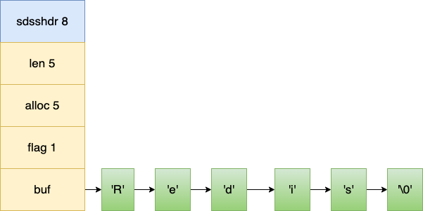
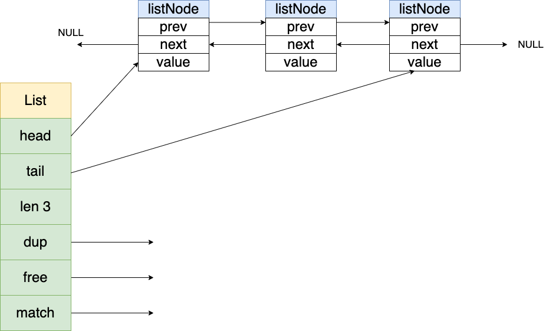
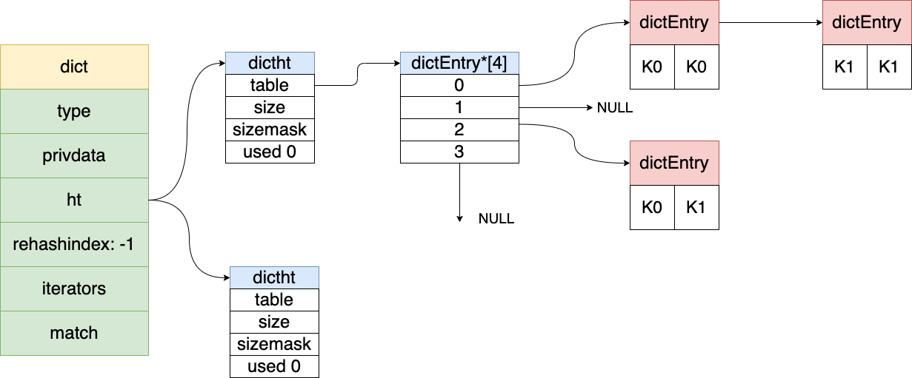
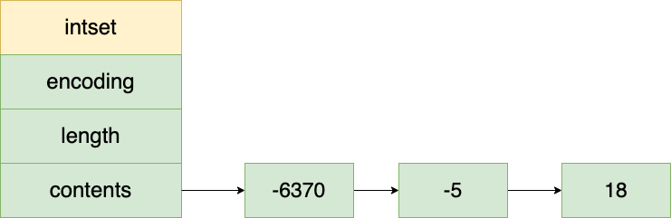

# Redis 安装
从官网下载对应的 redis 版本：

[redis 下载版本一览](https://download.redis.io/releases/?_gl=1*6zrsf6*_ga*MTcyNzYwMzIzLjE2NzcwNjc5NTU.*_ga_8BKGRQKRPV*MTY3NzA2Nzk1NC4xLjEuMTY3NzA2ODQwMC4xNS4wLjA.)

这里下载的 redis 版本是(5.0.6)。然后在 CentOS 解压：
```shell
# 解压 redis
tar -zxvf redis-5.0.6.tar.gz 
# 进入 redis 目录下进行编译，注意需要 gcc 编译器，没有就安装一下
cd redis-5.0.6
# 开始编译
make && make install
# 修改配置文件
vim redis.conf
```
# Redis 数据结构-应用场景
## String 字符串
### 字符串常见操作
```shell
set key value # 存入字符串键值对
mset key value key value……key value # 批量存储字符串键值对
setnx key value # 为不存在的键存入对应的值
get key # 获取一个字符串键值
mget key key……key # 批量获取字符串键值
del key key……key key # 批量删除键
expire key seconds # 设置一个键的过期时间(秒)

# 原子加减
incr key # 将 key 中存储的数字值加1
decr key # 将 key 中存储的数字值减1
incrby key increment # 将 key 所存储的值加上 increment
decrby key increment # 将
```
### 字符串应用场景
1. 单值缓存：`set zs zhangsanz`
2. 对象缓存：`set zs '{"name":"zhangsan"}'`
3. 分布式锁：`setnx product:10001 true` 返回 1 表示上锁成功，返回 0 表示上锁失败，业务完成后要释放锁。`set product:10001 true ex 10 nx` 
防止程序意外导致锁无法释放；
4. 计数器：文章阅读计数：`incr article:readcount:{文章id}`，获取文章阅读量：`get article:readcount:{文章id}`
5. Web集群session共享：spring session + redis 实现session共享；
6. 分布式系统全局序列号：`incrby orderId by`


## 哈希-hash
### Hash 常见操作
```shell
hset key field value # 存储一个哈希表key的键值
hsetnx key field value # 存储一个不存在的键的对应的值
hmset key field value field value……field value # 在一个哈希表中存储多个键值对
hget key field # 获取哈希表 key 对应的 field 的键值
hmget key field field……field # 批量获取hash表key中多个 field 键值
hdel key fild……field # 删除哈希表 key 中 field 键值
glen key # 返回哈希表 key 中 field 的数量
hgetall key # 返回哈希表key中所有的键值
hincrby by key field increment # 为哈希表 key 中 field 的键值加上增量 increment
```
### hash 应用场景
1. 对象缓存： `hmset user name zhansan age 18`
2. 电商购物车：用户为id为key，商品id为field，商品数量为value；

相比于 String 字符串，hash 可以归类数据，内存消耗比 String 小，存储比 String 更节省空间；其缺点是过期功能不能用在field上，只能作用在
key上；Redis 集群架构下不能大规模使用；(当 key 的属性有很多的时候，只能存在一个 redis 节点上，会导致这个节点压力比其他节点压力大很多)

## 列表 list
### list 常用操作
```shell
lpush key value……value # 将一个或多个值 value 插入到 key 列表的表头(最左边)
rpush key value……value # 将一个或多个值 value 插入到 key 列表的表尾(最右边)
LPOP key # 移除并返回 key 列表的头元素
RPOP key # 移除并返回 key 列表的尾元素
lrange key start stop # 返回列表 key 中指定区间内的元素
blpop key……key timeout #从key列表表头弹出一个元素，若列表中没有元素，阻塞等待 timeout 秒，若 timeout=0，则表示一直阻塞等待。
brpop key……key timeout #从key列表表尾弹出一个元素，若列表中没有元素，阻塞等待 timeout 秒，若 timeout=0，则表示一直阻塞等待。
```
### list 应用场景：
1. 消息队列；
2. 最新列表：如朋友圈点赞列表、评论列表；(适用于更新不那么频繁的业务场景)；
3. 排行榜：如销量、考生排名等(适用于定时计算，不适合实时计算)
## 集合 set
### set 常用操作
```shell
sadd key member……member # 往集合key 中存入元素，如果元素存在则忽略，反之则创建
srem key member……member # 从集合key中删除元素
smembers key # 获取集合key中所有元素
scard key # 获取集合key的元素个数
sismember  key  member //判断member元素是否存在于集合key中
spop  key  count				//从集合key中选出count个元素，元素从key中删除

Set运算操作
sinter  key……key 				//交集运算
sinterstore  destination  key……key		//将交集结果存入新集合destination中
sunion  key……key 				//并集运算
sunionstore  destination  key……key		//将并集结果存入新集合destination中
sdiff  key……key 				//差集运算
sdiffstore  destination  key……key		//将差集结果存入新集合destination中
```
### set 应用场景
1. 限时的抽奖活动：记录抽奖人数(`sadd key member`)，查看所有参见抽奖人员(`smembers key`), 随机选取 count 名中奖者(`srandmember key [count] / spop key [count]`);
2. 微信微博应用：点赞人员记录(`sadd key member`)，取消点赞(`srem key member`)

## 有序集合 zset
### zset 常用操作
```shell
zad key score member……score member	//往有序集合key中加入带分值元素
zrem key member……member		//从有序集合key中删除元素
zscore key member 			//返回有序集合key中元素member的分值
zincrby key increment member		//为有序集合key中元素member的分值加上increment 
zcard key				//返回有序集合key中元素个数
zrange key start stop withscores	//正序获取有序集合key从start下标到stop下标的元素
zrevrange key start stop withscores	//倒序获取有序集合key从start下标到stop下标的元素

Zset集合操作
zunionstore destkey numkeys key……key 	//并集计算
zinterstore destkey numkeys key……key	//交集计算
```

### zset 应用场景
1. 排行榜(天然的特性)；

# Redis 数据结构底层实现
## String(SDS)
在Redis 中，String的实现并没有采用 C 语言的字符数组 char[], 而是实现了一种叫做动态的字符串 SDS。

每个sds.h/sdshdr 结构表示一个 SDS 值。其结构如下：


1. len：记录当前已使用的字节数（不包括'\0'），获取SDS长度的复杂度为O(1)（C 语言中获取字符串长度的时间复杂度为 O(N)）。此外，
len值还避免了二进制安全与缓存区溢出的问题。 
2. free：free 属性值为 0 表示这个 SDS 没有分配任何未使用空间。 
3. flags：标记当前字节数组的属性，是sdshdr8还是sdshdr16等。 
4. buf：字节数组，用于保存字符串，包括结尾空白字符'\0'。

### Redis 实现自己的字符串的原因
1. 二进制安全：redis 是一个非关系型数据库，需要存储各式各样的数据。比如'Redi\', C语言中，用“\0”表示字符串的结束，如果字符串本身就有
“\0”字符，字符串就会被截断，即非二进制安全；若通过某种机制，保证读写字符串时不损害其内容，这就是二进制安全。
2. 频繁内存分配：每次增长或者缩短一个字符，程序都需要对保存这个字符串的数组进行一次内存重新分配操作。因为内存重分配涉及复杂的算法，并且可能
需要执行系统调用，所以它通常是一个比较耗时的操作。为了避免这种操作，SDS通过未使用空间解除了字符串长度和底层数组长度之间的关联。通过未使用
空间SDS实现了空间预分配和惰性空间释放两种优化策略。
> 空间预分配: 空间预分配用于优化SDS的字符串增长操作。当SDS的API对一个SDS进行修改，并且需要对SDS进行空间扩展的时候，程序不仅会为SDS分配
> 修改所必须要的空间，还会为SDS分配额外的未使用空间。其中，额外分配的未使用空间数量由以下公式决定：
> 
> 如果对SDS进行修改之后，SDS的长度将小于1MB，那么程序分配和len属性同样大小的未使用空间。
> 如果对SDS进行修改之后，SDS的长度将大于等于1MB，那么程序会分配1MB的未使用空间。
> 
> 惰性空间释放：惰性空间释放用于优化SDS的字符串缩短操作。当SDS的API需要缩短SDS保存的字符串时，程序不会立即使用内存重分配来回收缩短后多出来的字节，而是使用free属性将这些字节的数量记录下来，并等待将来使用。 
> 通过惰性空间释放策略，SDS避免了缩短字符串时所需的内存重分配操作，并为将来可能的增长操作提供了优化。 
> 与此同时，SDS也提供了响应的API可以在有需要时，真正的释放SDS里面的未使用空间，所以不用担心惰性空间释放策略会造成内存浪费。

## 链表
链表在Redis中应用的非常广，列表键的底层实现就是链表。当一个列表键包含了数量较多的元素，又或者列表中包含的元素都是比较长的字符串时，Redis 就
会使用链表作为链表键的底层实现。

此外，Redis的发布与订阅、慢查询、监视器等功能也用到了链表。

列表特点：
1. 双端链表：带有指向前置节点和后置节点的指针，获取这两个节点的复杂度为O(1)。 
2. 无环：表头节点的prev和表尾节点的next都指向NULL，对链表的访问以NULL结束。 
3. 链表长度计数器：带有len属性，获取链表长度的复杂度为O(1)。 
4. 多态：链表节点使用 void*指针保存节点值，可以保存不同类型的值。



列表的数据结构（adlist.h/listNode与adlist.h/list）：

listNode：
1. prev：前置节点。 
2. next：后置节点。 
3. value：节点值。 

list：
1. head：链表头节点。 
2. tail：链表尾节点。 
3. len：链表所包含的节点数量。 
4. dup：函数，用于复制ptr值，实现深度复制。 
5. free：函数，用于释放对应类型结构的内存。 
6. match：函数，用于对比链表节点所保存的值和另一个输入值是否相等。

## 字典数据结构
字典，又称为符号表（symbol table）、关联数组（associative array）或映射（map），是一种用于保存键值对的抽象数据结构。字典中的每一个键
都是唯一的，可以通过键查找与之关联的值，并对其修改或删除。

Redis的键值对存储就是用字典实现的，散列（Hash）的底层实现之一也是字典。


字典的数据结构（dict.h/dictht与dict.h/dict）：
1. type：针对不同类型的键值对，用于创建多类型的字典 
2. privdata：针对不同类型的键值对，用于创建多类型的字典 
3. ht：两个元素的数组，包含两个dictht哈希表，一般字典只使用ht[0]哈希表，ht[1]哈希表会在对ht[0]哈希表进行rehash（重哈希）的时候使用，
即当哈希表的键值对数量超过负载数量过多的时候，会将键值对迁移到ht[1]上 
4. rehashidx：rehashidx也是跟rehash相关的，rehash的操作不是瞬间完成的，rehashidx记录着rehash的进度，图中没有进行rehash，它的值为-1

dictht：
1. table：哈希链表（包含了一个节点类型为dictEntry的链表）
2. size：哈希链表大小
3. sizemask：哈希链表大小掩码，用于计算索引值，等于size-1
4. used：哈希链表已有节点的数量

dictEntry：
1. key：键 
2. next：下一个dictEntry节点 
3. value：union类型，支持不同类型的值

## 整数集合
整数集合（intset）是Redis用于保存整数值的集合抽象数据结构，可以保存类型为int16_t、int32_t、int64_t的整数值，并且保证集合中不会出现
重复元素.整数集合是集合（Set）的底层实现之一，如果一个集合只包含整数值元素，且元素数量不多时，会使用整数集合作为底层实现。



整数集合的数据结构（inset.h/inset）：
1. encoding：决定contents数组的真正类型，如INTSET_ENC_INT16、INTSET_ENC_INT32、INTSET_ENC_INT64。
2. length：记录整数集合的元素数量，即contents数组长度
3. contents：整数集合的每个元素在数组中按值的大小从小到大排序，且不包含重复项。

### 整数集合的升级
当想要添加一个新元素到整数集合中时，并且新元素的类型比整数集合现有的所有元素的类型都要长，整数集合需要先进行升级，才能将新元素添加到整数
集合里面。每次向整数集合中添加新元素都有可能会引起升级，每次升级都需要对底层数组已有的所有元素进行类型转换。

升级添加新元素： 
1. 根据新元素类型，扩展整数集合底层数组的空间大小，并为新元素分配空间。 
2. 把数组现有的元素都转换成新元素的类型，并将转换后的元素放到正确的位置，且要保持数组的有序性。

添加新元素到底层数组。

整数集合的升级策略可以提升整数集合的灵活性，并尽可能的节约内存。另外，整数集合不支持降级，一旦升级，编码就会一直保持升级后的状态。

## 跳跃表
一个普通的单链表查询一个元素的时间复杂度为O(N)，即便该单链表是有序的。使用跳跃表（SkipList）是来解决查找问题的，它是一种有序的数据结构，
不属于平衡树结构，也不属于Hash结构，它通过在每个节点维持多个指向其他节点的指针，而达到快速访问节点的目的 跳跃表是有序集合（Sorted Set）
的底层实现之一，如果有序集合包含的元素比较多，或者元素的成员是比较长的字符串时，Redis会使用跳跃表做有序集合的底层实现。

跳跃表其实可以把它理解为多层的链表，它有如下的性质：
1. 多层的结构组成，每层是一个有序的链表 
2. 最底层（level 1）的链表包含所有的元素 
3. 跳跃表的查找次数近似于层数，时间复杂度为O(logn)，插入、删除也为 O(logn)
4. 跳跃表是一种随机化的数据结构(通过抛硬币来决定层数)


