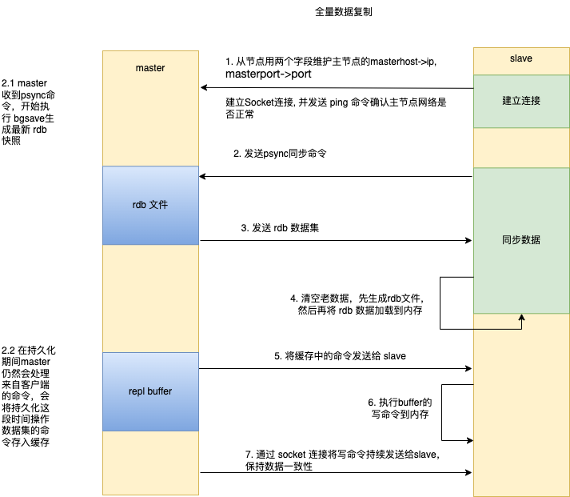
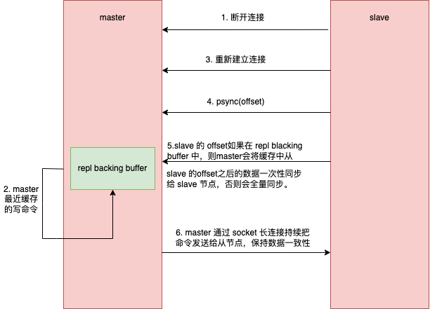

# Redis 单线程和高性能
通常讲 redis 单线程指的是 Redis 的网络 I/O 和指令读写是由一个线程完成的，至于其他的任务，比如持久化、数据同步等就是异步完成的；

虽然网络 I/O 和指令读写是单线程，但是 Redis 是在内存中工作，因此即使是单线程，执行效率也是很高的；其次，Redis I/O 模型采用 epoll 来实现
多路复用，这也是 Redis 能处理那么多并发客户连接的原因；(I/O 模型详见 NIO 章节[NIO](https://github.com/an-1024/Middleware_St/blob/master/nio/src/main/resources/note/1.NIOBIO.md))

# Redis 持久化
刚才也提到过，Redis 是工作在内存中的，所有的数据也在内存中。所以一旦服务器宕机，Redis 缓存的数据就会全部丢失。因此 Redis 针对于这种情况实现
了两种持久化机制：RDB(快照：全量备份)、AOF(增量备份)。
## RDB 快照
在默认情况下，Redis 将内存数据快照保存在名为 dump.rdb 文件中。可以通过修改 redis.conf 文件参数 `save` 来设置多长时间内，修改多少次进行一次
保存。如`save 60 1000`，60秒内至少有1000个键被修改，就会自动保存一次。

1. 数据丢失问题：这个保存很明显会暴露出一个问题，就是在达到这个触发节点的时候，Redis 宕机，数据就会丢失。
2. 时点性问题：写入数据需要时间，比如 8点开始写入数据，需要4s写入，那么最终存入磁盘的数据是哪一刻的呢？
3. 效率问题：在服务线上请求的同时，Redis 还需要进行内存快照，内存快照要求 Redis 必须进行文 件 IO 操作，可文件 IO 操作是不能使用多路复用 API。

先来谈谈 2、3 问题。Redis 为了解决这样的问题，采用操作系统的写时复制技术(Copy-On-Write,COW)，就是从父进程中 fork 一个子进程，子进程完全可以共享
父进程的数据，如果父进程是对数据进行读操作，对于子进程没有影响，直接向磁盘写入数据。如果是写操作，那么父进程会将那一刻的数据复制出一份出来，然后在新的
数据上进行修改，而子进程写入的数据还是操作数据之前那一刻的数据。因此问题 2 中写入的数据是 fork 子进程那一刻的。

## AOF(增量备份)
AOF 就是为了解决 RDB 数据丢失的问题。AOF 会将修改的每一条指令记录进文件appendonly.aof中(先写入os cache，每隔一段时间 fsync到磁盘)。可以
通过参数`# appendonly yes` 进行控制。打开这个机制后，每当 redis 修改一个数据集，这个命令就会被追加到这个文件的末尾。这样即使 redis 宕机，
也可以通过 aof 文件进行数据恢复。同样 redis 也提供了配置策略：
```shell
appendfsync always # 每次有新命令追加到 AOF 文件时就执行一次 fsync ，非常慢，也非常安全。
appendfsync everysec # 每秒 fsync 一次，足够快，并且在故障时只会丢失 1 秒钟的数据。
appendfsync no # 从不 fsync ，将数据交给操作系统来处理。更快，也更不安全的选择。
```

## fsync 
Linux 的 glibc 提供了 fsync(int fd)函数可以将指定文件的内容强制从内核缓存刷到磁 盘。只要 Redis 进程实时调用 fsync 函数就可以保证 aof 
日志不丢失。但是 fsync 是一个 磁盘 IO 操作，它很慢!如果 Redis 执行一条指令就要 fsync 一次，那么 Redis 高性能的 地位就不保了。 所以在
生产环境的服务器中，Redis 通常是每隔 1s 左右执行一次 fsync 操作，周期 1s 是可以配置的。这是在数据安全性和性能之间做了一个折中，在保持
高性能的同时，尽可能 使得数据少丢失。

redis 在业务长期运行期间，AOF的日志肯定会变得很长很长🤮。如果实例宕机，那么使用 AOF 恢复的时候，会导致 Redis 长时间无法对外提供服务，这显然
是不能容忍的。所以需要对 AOF 进行瘦身。

### AOF 日志瘦身
Redis 提供了 bgrewriteaof 指令用于对 AOF 日志进行瘦身。其原理就是开辟一个子进程对内存进行遍历转换成一系列 Redis 的操作指令，
序列化到一个新的 AOF 日志文件中。做法就是去掉相同键值无用的指令，只保持对该 key 操作的最新指令。

## 小结
1. 快照：快照是通过开启子进程的方式进行的，它是一个比较耗资源的操作，遍历整个内存，大块写磁盘会加重系统负载；
2. AOF：fsync 是一个耗时的 IO 操作，它会降低 Redis 性能，同时也会增加系统 IO 负担；

所以通常 Redis 的主节点是不会进行持久化操作，持久化操作主要在从节点进行。从节 点是备份节点，没有来自客户端请求的压力，它的操作系统资源
往往比较充沛。

## Redis 4.0 混合持久化
上面提到过，RDB 容易丢失大量数据，一般使用 aof 恢复，但是 aof 恢复数据相比于 rdb 来说要慢很多，在 redis 实例较大的情况下，启动很慢。为了
解决这样的问题，Redis 4.0 带来了一个新的持久化选项——混合持久化。将 RDB 文件和增量的 aof 日志文件放到一起。注意这里的 aof 日志不再是全量的
日志了，而是自持久化开始到持久化结束这一段时间日志的增量。

## Redis 数据备份策略
1. 写crontab定时调度脚本，每小时都copy一份rdb或aof的备份到一个目录中去，仅仅保留最近48 小时的备份
2. 每天都保留一份当日的数据备份到一个目录中去，可以保留最近1个月的备份
3. 每次copy备份的时候，都把太旧的备份给删了
4. 每天晚上将当前机器上的备份复制一份到其他机器上，以防机器损坏

# Redis 主从架构
## 主从配置
建立了两个虚拟机Dev_Server_01，Dev_server_02。然后配置一主一从
Dev_Server_02 从节点配置，修改 redis.config 配置
```shell
port 6380 # 指定启动端口号
pidfile /var/run/redis_6380.pid # 把pid进程号写入pidfile配置的文件
logfile"6380.log"  # log 日志文件命名
dir /root/Dev_Azh/redis/data/6380 #指定数据存放目录
#bind127.0.0.1 # 注释掉 bind
replicaof 10.211.55.3 # 配置主节点的ip地址
replica‐read‐only yes # 配置从节点只读
protected-mode no # 关闭保护模式
```
注意关闭虚机的防火墙，否则出现：
```shell
17325:S 18 Oct 2022 12:52:38.771 * Connecting to MASTER 10.211.55.3:6379
17325:S 18 Oct 2022 12:52:38.771 * MASTER <-> REPLICA sync started
17325:S 18 Oct 2022 12:52:38.771 # Error condition on socket for SYNC: No route to host
```
关闭 CentOS7 命令：
```shell
firewall-cmd --state # 查看防火墙状态
systemctl stop firewalld.service # 关闭防火墙
systemctl disable firewalld.service # 禁止开机启动防火墙

```
启动主节点 Dev_Server_01，启动从节点 Dev_server_02
```shell
./redis-server ../redis.conf 
# 在节点 A 设置参数
set masterA "主节点设置参数"
# 在从节点查看参数
keys * # 可以看到对应的参数已经被同步过来了
```

## Reids 主从工作原理
主从复制过程大体可以分为3个阶段：连接建立阶段（即准备阶段）、数据同步阶段、命令传播阶段。

1. 连接建立阶段：
   1. 先在缓存中保存 master 节点信息；日志信息如下：
   ```shell
   efore turning into a replica, using my master parameters to synthesize a cached master: I may be able to synchronize 
   with the new master with just a partial transfer
   ```
   2. 建立 socket 长连接；日志信息如下：
   ```shell
   Connecting to MASTER 10.211.55.3:6379
   MASTER <-> REPLICA sync started
   ```
   3. 发送 ping 命令确认主机网络畅通；
   ```shell
   Master replied to PING, replication can continue...
   ```
2. 数据同步阶段:
   1. 从节点启动，总会向 master 发送一个 psync(2.8以前发送 sync 命令) 命令到 master 请求复制数据；
   2. 主节点收到 psync 命令会在后台进行数据持久化通过bgsave生成最新的rdb快照文件, 持久化期间仍然会接收客户端的请求；
   3. 在持久化期间，master会将接收到可能修改数据集的命令缓存到内存中；
   4. master 持久化完成后，会将 rdb 文件数据集发给 slave 节点，slave 会先将这些数据生成 rdb 文件，然后再加载到内存中；
   5. 接着master会将之前加载到缓存中的命令发送给 slave
3. 命令传播阶段：
   1. 数据同步阶段完成后，主从节点进入命令传播阶段；在这个阶段主节点将自己执行的写命令发送给从节点，从节点接收命令并执行，从而保证主从节点数据的一致性。
      
注意：当master与slave之间的连接由于某些原因而断开时，slave能够自动重连Master，如果master收到了多 个slave并发连接请求，它只会进行一
次持久化，而不是一个连接一次，然后再把这一份持久化的数据发送 给多个并发连接的slave。

主从同步原理图(全量数据复制)：


### 数据部分复制
从节点断开与主节点的连接，再次连接的时候，一般都会对数据进行全量复制。从redis2.8开始，master和它所有的 slave都维护了复制的数据下标
offset和master的进程id，因此，当网络连接断开后，slave会请求master 继续进行未完成的复制，从所记录的数据下标开始。如果master进程id变化了，
或者从节点数据下标 offset 太旧，已经不在master的缓存队列里了，那么将会进行一次全量数据的复制。这种机制就叫**断点续传**

如图所示：

注意：如果有很多从节点，为了缓解主从复制风暴(多个从节点同时复制主节点导致主节点压力过大)，可以做如下架构，让部分从节点与从节点(与主节点同步)
同步数据


