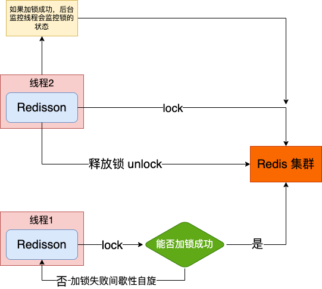

目录
=================

* [Synchronized 锁-多机场景失效](#synchronized-锁-多机场景失效)
* [Redis 分布式锁](#redis-分布式锁)
   * [集群下锁丢失的问题](#集群下锁丢失的问题)
   * [RedLock](#redlock)
   * [如何提升分布式的性能](#如何提升分布式的性能)
* [缓存优化场景](#缓存优化场景)
   * [Redis 缓存数据冷热分离](#redis-缓存数据冷热分离)
   * [缓存击穿](#缓存击穿)
   * [缓存穿透](#缓存穿透)
   * [冷门数据突变热点数据导致系统压力暴增(热点缓存重建问题 )](#冷门数据突变热点数据导致系统压力暴增热点缓存重建问题-)
   * [双写数据不一致](#双写数据不一致)
      * [更新数据立即更新缓存](#更新数据立即更新缓存)
      * [更新数据库删除缓存](#更新数据库删除缓存)
   * [代码实现](#代码实现)
      * [第一： 缓存商品信息不做永久存储，避免内存的浪费](#第一-缓存商品信息不做永久存储避免内存的浪费)
      * [第二：缓存击穿。](#第二缓存击穿)
      * [第三：缓存穿透。](#第三缓存穿透)
         * [第四：冷门数据突然变成热门数据。](#第四冷门数据突然变成热门数据)
      * [缓存数据库双写不一致](#缓存数据库双写不一致)
   * [缓存雪崩](#缓存雪崩)


# Synchronized 锁-多机场景失效
先看一段模拟扣减库存的代码
```java
@RestController
public class RedisLockController {
    
    @Resource
    private StringRedisTemplate stringRedisTemplate;

    @RequestMapping("/deduct_stock")
    public String deductStock() {
        synchronized (this) {
            // 提前在redis服务上设置 300 个库存
            int stock = Integer.parseInt(stringRedisTemplate.opsForValue().get("stock"));
            if (stock > 0) {
                int realStock = stock - 1;
                // 重新设置缓存
                stringRedisTemplate.opsForValue().set("stock", realStock + "");
                System.out.println("扣减库存成功，剩余库存：" + realStock);
            } else {
                System.out.println("扣减库存失败，库存不足");
            }
            return String.valueOf(stock);
        }
    }
}
```
这段代码在单机的情况下是没问题的。但是目前的系统架构基本都是微服务多机，而 synchronized 锁是基于 JVM 级别，只能在当前机器中生效，多机环境下，
在高并发的情况下，这段代码是有问题的。

配置 nginx 代理，修改配置文件
```text
    upstream redislock{  # 代理的地址(物理机网卡 ip)
        server 192.168.0.200:8080 weight=1;
        server 192.168.0.200:8090 weight=1;
    }

    server {
        listen       80;
        server_name  localhost;

        #charset koi8-r;

        #access_log  logs/host.access.log  main;

        location / {
            root   html;
            index  index.html index.htm;
            proxy_pass  http://redislock;  # 代理的路径
        }
```

配置好后重新启动 nginx
```shell
nginx -s reload
```

然后配置不同的端口号，启动两个相同的服务，通过链接[扣减库存](http://10.211.55.3/deduct_stock) 访问服务，看看 nginx 是否代理生效(会将请求分发
到不同的服务器上)。测试结果：
```text
2023-03-07 10:11:41.371  INFO 59969 --- [           main] o.s.b.w.embedded.tomcat.TomcatWebServer  : Tomcat started on port(s): 8080 (http) with context path ''
2023-03-07 10:11:41.378  INFO 59969 --- [           main] c.anzhi.redislock.RedisLockApplication   : Started RedisLockApplication in 1.116 seconds (JVM running for 1.694)
2023-03-07 10:11:45.292  INFO 59969 --- [nio-8080-exec-1] o.a.c.c.C.[Tomcat].[localhost].[/]       : Initializing Spring DispatcherServlet 'dispatcherServlet'
2023-03-07 10:11:45.293  INFO 59969 --- [nio-8080-exec-1] o.s.web.servlet.DispatcherServlet        : Initializing Servlet 'dispatcherServlet'
2023-03-07 10:11:45.296  INFO 59969 --- [nio-8080-exec-1] o.s.web.servlet.DispatcherServlet        : Completed initialization in 3 ms
扣减库存成功，剩余库存：299
扣减库存成功，剩余库存：298
扣减库存成功，剩余库存：297


2023-03-07 19:30:01.061  INFO 62217 --- [           main] o.s.b.w.embedded.tomcat.TomcatWebServer  : Tomcat started on port(s): 8090 (http) with context path ''
2023-03-07 19:30:01.069  INFO 62217 --- [           main] c.anzhi.redislock.RedisLockApplication   : Started RedisLockApplication in 1.546 seconds (JVM running for 2.193)
2023-03-07 19:45:11.877  INFO 62217 --- [nio-8090-exec-1] o.a.c.c.C.[Tomcat].[localhost].[/]       : Initializing Spring DispatcherServlet 'dispatcherServlet'
2023-03-07 19:45:11.877  INFO 62217 --- [nio-8090-exec-1] o.s.web.servlet.DispatcherServlet        : Initializing Servlet 'dispatcherServlet'
2023-03-07 19:45:11.882  INFO 62217 --- [nio-8090-exec-1] o.s.web.servlet.DispatcherServlet        : Completed initialization in 5 ms
扣减库存成功，剩余库存：296
```

接下来使用 jmeter 模拟高并发来压测一下这段代码的问题：
1. 下载 Jmeter: [下载地址](https://dlcdn.apache.org//jmeter/binaries/apache-jmeter-5.5.tgz)
2. 下载完成之后，进行解压,然后为 jmeter 配置环境变量
```shell
# Jmeter Config
export JMETER_HOME=/Users/azh/Dev_AZH/Java_Env/apache-jmeter-5.5
# 配置环境生效
export PATH=$PATH:$JAVA_HOME/bin:$MAVEN_HOME/bin:$GRADLE_HOME/bin:$GH_MD_TOC/:$JMETER_HOME/bin

# 配置完成后保存，退出，使环境变量生效
source ~/.bash_profile

# 启动 Jmeter
jmeter
```
启动成功后会弹出一个 Jmeter 的操作界面，然后开始配置我们的压测：


具体页面配置如下：


在压测的时候尽量选择一个压测报告，可以实时监控压测的情况：


点击绿色运行按钮，开始压测，第一次需要你保存压测计划，保存完成之后，压测就开始了，下图是压测报告


8080 服务终端部分输出结果：
```text
扣减库存成功，剩余库存：299
扣减库存成功，剩余库存：298
扣减库存成功，剩余库存：297
扣减库存成功，剩余库存：294
扣减库存成功，剩余库存：293
扣减库存成功，剩余库存：291
扣减库存成功，剩余库存：290
扣减库存成功，剩余库存：287
扣减库存成功，剩余库存：286
扣减库存成功，剩余库存：284
扣减库存成功，剩余库存：283
扣减库存成功，剩余库存：281
扣减库存成功，剩余库存：278
扣减库存成功，剩余库存：277
扣减库存成功，剩余库存：276
扣减库存成功，剩余库存：274
```

8090 服务终端输出结果：
```text
扣减库存成功，剩余库存：296
扣减库存成功，剩余库存：295
扣减库存成功，剩余库存：294
扣减库存成功，剩余库存：293
扣减库存成功，剩余库存：292
扣减库存成功，剩余库存：291
扣减库存成功，剩余库存：290
扣减库存成功，剩余库存：289
扣减库存成功，剩余库存：288
扣减库存成功，剩余库存：287
扣减库存成功，剩余库存：286
扣减库存成功，剩余库存：285
扣减库存成功，剩余库存：284
扣减库存成功，剩余库存：283
扣减库存成功，剩余库存：282
扣减库存成功，剩余库存：281
```

仔细观察结果就会发现会有重复的库存出现。证明了 Synchronized 锁是无法保证多机情况下的并发安全。因此需要利用 redis 实现分布式锁。

# Redis 分布式锁
针对于上面的情况，还是需要引入 redis 服务进行枷锁。一般来说，针对并发量不是很大的情况下，我们设计分布式锁的时候设计大致如下：
1. 使用唯一值作为加锁条件，比如商品的 id；
2. 防止死锁的产生，需要给锁设置超时时间。以下情况会导致死锁的产生：
   1. 业务异常导致商品 id 加锁没有释放；
   2. redis 宕机导致锁没有释放；
3. 加锁时命令的原子性，即加锁和超时间设置是原子性的，不能被其他线程打断；

所以一个简单的 reids 分布式锁实现如下
```java
@RestController
public class RedisLockController {
    /**
     * redis 实现一个简单的分布式锁
     * @return
     */
    @RequestMapping("/deduct_stock_redislock")
    public String deductStockByRedisLock() {
        // 以商品 id 设置锁, 以及超时时间，防止宕机死锁。setIfAbsent 保证命令的原子性
        Boolean aBoolean = redisTemplate.opsForValue().setIfAbsent("product_Id_A", "product", 10, TimeUnit.SECONDS);
        // 如果设置锁失败，表明抢锁失败，业务上可以禁止下单或者返回一个错误码，让前端返回一个友好的提示
        if (Boolean.FALSE.equals(aBoolean)) {
            return "error_code";
        }

        // 捕获业务异常释放锁，防止死锁
        try {
            // 提前在redis服务上设置 300 个库存
            int stock = Integer.parseInt(stringRedisTemplate.opsForValue().get("stock"));
            if (stock > 0) {
                int realStock = stock - 1;
                // 重新设置缓存
                stringRedisTemplate.opsForValue().set("stock", realStock + "");
                System.out.println("扣减库存成功，剩余库存：" + realStock);
            } else {
                System.out.println("扣减库存失败，库存不足");
            }
            return String.valueOf(stock);
        } finally {
            redisTemplate.delete("product_Id_A");
        }
    }
}
```
上述就是一种比较简单的分布式锁的实现。

对于上面的代码还是存在问题，比如流量激增的情况下，这样会导致系统接口响应变慢。这样会导致锁被提前释放。场景如下：
1. 第一个线程执行时间超过了 10s，锁失效被释放。在并发的场景下，此时锁被其他线程获取，继续执行业务逻辑，然后在执行过程中，第一个线程执行完成，将第二个线程加的锁释放了；以此类推，极端情况下 
最终导致这个分布式锁形同虚设。
```java
/**
 * 针对于上述的情况有两个原因：
 * 1. 因为其他线程删除了不属于自己的分布式锁；那么根据这个思路可以为每一个线程分配它自己专属的标识，在删除 redis 锁的时候判断
 * 这把锁是否属于自己;
 * 2. 业务的执行时间不确定，锁超时导致锁被释放
 * 
 * 本质上还是因为业务执行时间不确定，导致锁超时释放。第一个可能是我们比较快速想到的一个方案，但是不是问题的本质。
 */
@RestController
public class RedisLockController {
   /**
    * redis 实现一个简单的分布式锁
    * @return
    */
   @RequestMapping("/deduct_stock_redislock")
   public String deductStockByRedisLock() {
      // 以商品 id 设置锁, 以及超时时间，防止宕机死锁。setIfAbsent 保证命令的原子性
      // 将商品名称用 UUID 替换，用来当作分布式锁的线程标识
      String clientId = UUID.randomUUID().toString();
      Boolean aBoolean = redisTemplate.opsForValue().setIfAbsent("product_Id_A",clientId, 10, TimeUnit.SECONDS);
      // 如果设置锁失败，表明抢锁失败，业务上可以禁止下单或者返回一个错误码，让前端返回一个友好的提示
      if(Boolean.FALSE.equals(aBoolean)){
         return "error_code";
      }

      // 捕获业务异常释放锁，防止死锁
      try {
         // 提前在redis服务上设置 300 个库存
         int stock = Integer.parseInt(stringRedisTemplate.opsForValue().get("stock"));
         if (stock > 0) {
            int realStock = stock - 1;
            // 重新设置缓存
            stringRedisTemplate.opsForValue().set("stock", realStock + "");
            System.out.println("扣减库存成功，剩余库存：" + realStock);
         } else {
            System.out.println("扣减库存失败，库存不足");
         }
         return String.valueOf(stock);
      }finally {
         if(clientId.equals(stringRedisTemplate.opsForValue().get("product_Id_A"))){
            redisTemplate.delete("product_Id_A");
         }
      }
   }
}
```
这样貌似解决了线程自己的锁被其他线程释放的问题，但是实际上还是存在问题。因为不知道你这个业务的确切执行时间，即使统计了日常的执行时间，但是
总是会出现非正常的情况导致锁超时，所以本质上问题仍然没有得到解决。

从上面的分析我们知道是因为业务执行时间很难判定，导致锁的超时时间无法设定。所以就可以这样考虑，需要一个监控，只要业务没有结束，那么在锁超时的
时候就需哟对锁续命。这个实现已经有大牛给实现了——RedisSon。

使用 Redisson 首先需要对 Redisson 进行配置连接，然后才能注入使用。在启动类中直接添加配置
```java
@SpringBootApplication
public class RedisLockApplication {
    public static void main(String[] args) {
        SpringApplication.run(RedisLockApplication.class, args);
    }
    
    // 配置 RedisSon
    @Bean
    public Redisson redisson(){
        Config config = new Config();
        // redis-cluster 连接 
        config.useClusterServers().addNodeAddress("redis://10.211.55.3:8001", "redis://10.211.55.5:8006")
                .addNodeAddress("redis://10.211.55.4:8003", "redis://10.211.55.3:8002")
                .addNodeAddress("redis://10.211.55.5:8005","redis://10.211.55.4:8004");

        return (Redisson) Redisson.create(config);
    }
}
```
controller 层修改代码
```java
@RestController
public class RedisLockController {
   /**
    * redisson 解决超时问题
    * @return
    */
   @RequestMapping("/deduct_stock_redissonlock")
   public String deductStockByRedissonLock() {
      // 首先获取锁对象
      RLock redisLock = redisson.getLock("product_Id_A");
      // 加分布式锁
      redisLock.lock();
      // 捕获业务异常释放锁，防止死锁
      try {
         // 提前在redis服务上设置 300 个库存
         int stock = Integer.parseInt(stringRedisTemplate.opsForValue().get("stock"));
         if (stock > 0) {
            int realStock = stock - 1;
            // 重新设置缓存
            stringRedisTemplate.opsForValue().set("stock", realStock + "");
            System.out.println("扣减库存成功，剩余库存：" + realStock);
         } else {
            System.out.println("扣减库存失败，库存不足");
         }
         return String.valueOf(stock);
      } finally {
         redisLock.unlock();
      }
   }
}
```
对于上述代码其实还是存在问题的，不在于锁，而是在扣减库存的操作。这个操作并不是原子操作的。所以也是需要优化的。

根据上述总结的分布式锁的问题场景，Redisson工作原理大致如图所示：


如下是 Redisson 的核心代码
```java
public class RedissonLock extends RedissonExpirable implements RLock {
   public void lockInterruptibly(long leaseTime, TimeUnit unit) throws InterruptedException {
      // 获取线程 id
      long threadId = Thread.currentThread().getId();
      // 加锁，使用 lua 脚本操作加锁 
      Long ttl = this.tryAcquire(leaseTime, unit, threadId);
      if (ttl != null) {
          // 抢锁失败的线程订阅 Redis 发布的信息(锁的状态信息)
         RFuture<RedissonLockEntry> future = this.subscribe(threadId);
         // 唤醒等待锁的线程
         this.commandExecutor.syncSubscription(future);

         try {
             // while 循环让线程等待锁
            while (true) {
                // 再次尝试，返回锁的剩余时间
               ttl = this.tryAcquire(leaseTime, unit, threadId);
               // 如果 ttl 为空表示加锁成功
               if (ttl == null) {
                  return;
               }

               // 如果抢锁失败，切锁的时间还没有到期，那么让其他线程阻塞
               if (ttl >= 0L) {
                   // 阻塞 ttl 时间后，获取信号量，阻塞
                  this.getEntry(threadId).getLatch().tryAcquire(ttl, TimeUnit.MILLISECONDS);
               } else {
                   // 如果说锁没有过期时间，则一直阻塞
                  this.getEntry(threadId).getLatch().acquire();
               }
            }
         } finally {
             // 取消订阅
            this.unsubscribe(future, threadId);
         }
      }
   }
}
```
## 集群下锁丢失的问题
在 Redis 单机的情况下，可以保证加的锁不会丢失。但是在集群的情况下，锁会出现丢失的情况。场景如下：
1. 线程1向主节点写入了一个锁，此时主节点还没有同步到从节点上，此时主节点宕机，那么即使重新选出了一个主节点，但是这个主节点上并没有保存线程1
设置的分布式锁；
2. 此时线程2刚好发起请求，理所当然的获取到了锁；然后线程1执行完成，把线程2的锁干掉了，最终导致这个锁几乎失效；

为了解决锁丢的问题，Redisson 实现了红锁的机制。

## RedLock
RedLock 的工作原理就是设置奇数个(大于等于1)主节点，没有从节点，在设置锁的时候必须有半数以上的节点设置成功才能表示这个分布式锁获取成功。
但是这种解决办法个人觉得并不实用。有以下几个原因：
1. 这种设计只保证了 CP，即一致性，和分区容错性。所以一旦集群挂了半数以上，那么无论什么样的情况，都无法加锁；
2. 降低了读写锁的效率，需要同时对多个节点读写锁，肯定不如只对集群中一个主节点读写快；
3. 依然存在丢锁的可能。如：Redis 持久化AOF，为了保证 Redis 效率，一般设置 1s 备份一次，如果写入的锁主节点刚好在这 1s 挂掉，然后重启，此时
在线程1加锁完成之后，线程2在主节点重启后，依然可以加锁，所以又回到了丢锁的问题上；

这么看来好像并没有解决丢锁的问题。 

## 如何提升分布式的性能
1. 分段锁：比如讲一个商品拆分成多个多个库存，然后每个库存对应多个key，这样一来，就由串行锁变成了并发锁；(参考currenthashmap)

# 缓存优化场景
## Redis 缓存数据冷热分离
1. 基本的冷热分离方案：针对于经常查询的数据，以商品为列。可以在将商品加入缓存的时候设置一个延期时间，每次查询一次就延长一次再缓存中的时间，
这样就会逐渐将热点数据和冷门儿数据慢慢地分离出来；

## 缓存击穿
场景：以京东、淘宝的商品为例。商品信息肯定要放入缓存中展示。那么当商家上架商品的时候，进行批量操作，此时这批商品在缓存中的过期时间是一样的，
当有很多商家都这样操作，那么到了一定时间后，缓存中的商品信息过期，刚好这个时候有大量的请求打到服务器上，而因为缓存中的商品信息已经失效，此时
只能到数据库中查询，这种现象就是缓存击穿。

上述现象概括一下就是：缓存中大量的数据在同一时间失效，然后大量的请求直接打到了数据库上；解决办法就是设置随机的过期时间，不要让数据同一时间失效；

## 缓存穿透
场景：秒杀场景下，删除了一个商品(缓存，数据库都删)，此时大量的请求要查询这个商品，发现缓存、数据库都没有，这种现象称为缓存穿透。

所以缓存穿透就是大量的请求访问一个不存在数据。解决办法：
1. 请求不存在的数据，返回一个空的字符串；但是这种会导致另外一种情况，就是换不同的数据进行请求，这种会导致缓存中存储了大量的空串，大量的占用缓存空间，
针对这种请求就是设置一个过期时间；

## 冷门数据突变热点数据导致系统压力暴增(热点缓存重建问题 )
场景：在缓存中已经过期的冷门商品，某一天被某平台的主播发现是个不错的产品，于是发起了抢购。瞬间激增的访问量，几十万的请求直接打到了服务器上，导致服务器
压力暴增；

解决办法：分布式锁 + DCL。利用锁只允许单个线程进行数据请求，然后这个线程将获取到的商品数据放入缓存；之后的请求在获取对象的时候由于缓存中已经缓存了
商品信息，就不会再去数据库中查找。DCL 的作用就是双重检测，在上锁之前检测一次，上锁之后检测一次。

## 双写数据不一致
### 更新数据立即更新缓存
如图所示：


场景描述：同时有3个线程发起请求，线程1写入数据库 stock=10，线程3查询缓存，缓存中没有相关信息，查询数据库为 10，然后线程1写完数据库后更
新缓存完成，此时线程2开始更新数据库，stock=6，然后更新缓存 stock=6，此时线程开始更新缓存，stock=10，结果导致缓存与数据库不一致。

### 更新数据库删除缓存


场景描述：同时有3个线程发起请求，线程1写入数据库 stock=10，然后删除缓存；线程3查询缓存，缓存中没有相关信息，查询数据库为 10，
线程2开始更新数据库，stock=6，然后删除缓存，线程3更新缓存 stock=10，结果导致缓存与数据库不一致。

缓存与数据库不一致的问题可以利用分布式锁来解决。在每次查询数据库之前加锁，在更新完缓存之后释放锁，同样在更新数据库之前加锁，更新之后解锁。

## 代码实现
根据上述问题，我们用下面代码实现：
创建实体类 Product
```java
package com.anzhi.redislockpracticalapplication.entity;

import lombok.AllArgsConstructor;
import lombok.Getter;
import lombok.NoArgsConstructor;
import lombok.Setter;

import java.math.BigDecimal;
import java.util.Date;

@Getter
@Setter
@AllArgsConstructor
@NoArgsConstructor
public class Product {
    private Long id;

    private Long brandId;

    private Long productCategoryId;

    private Long feightTemplateId;

    private Long productAttributeCategoryId;

    private String name;

    private String pic;

    //货号
    private String productSn;

    //删除状态：0->未删除；1->已删除
    private Integer deleteStatus;

    //上架状态：0->下架；1->上架
    private Integer publishStatus;

    //新品状态:0->不是新品；1->新品
    private Integer newStatus;

    //推荐状态；0->不推荐；1->推荐
    private Integer recommandStatus;

    //审核状态：0->未审核；1->审核通过
    private Integer verifyStatus;

    //排序
    private Integer sort;

    //销量
    private Integer sale;

    private BigDecimal price;

    //促销价格
    private BigDecimal promotionPrice;

    //赠送的成长值
    private Integer giftGrowth;

    //赠送的积分
    private Integer giftPoint;

    //限制使用的积分数
    private Integer usePointLimit;

    //副标题
    private String subTitle;

    //市场价
    private BigDecimal originalPrice;

    //单位
    private String unit;

    //商品重量，默认为克
    private BigDecimal weight;

    //是否为预告商品：0->不是；1->是
    private Integer previewStatus;

    //以逗号分割的产品服务：1->无忧退货；2->快速退款；3->免费包邮
    private String serviceIds;

    private String keywords;

    private String note;

    //画册图片，连产品图片限制为5张，以逗号分割
    private String albumPics;

    private String detailTitle;

    //促销开始时间
    private Date promotionStartTime;

    //促销结束时间
    private Date promotionEndTime;

    //活动限购数量
    private Integer promotionPerLimit;

    //促销类型：0->没有促销使用原价;1->使用促销价；2->使用会员价；3->使用阶梯价格；4->使用满减价格；5->限时购
    private Integer promotionType;

    //品牌名称
    private String brandName;

    //商品分类名称
    private String productCategoryName;

    //商品描述
    private String description;

    private String detailDesc;

    //库存
    private Integer stock;

    //库存预警值
    private Integer lowStock;

    //产品详情网页内容
    private String detailHtml;

    //移动端网页详情
    private String detailMobileHtml;

    private static final long serialVersionUID = 1L;

}
```
实现Product dao 层(没有数据库，模拟操作)
```java
@Mapper
public class ProductMapper {
    /**
     * 创建商品
     */
    public Product create(Product product) {
        System.out.println("创建商品成功");
        return product;
    }

    /**
     * 更新商品数据
     * @param product
     * @return
     */
    public Product update(Product product) {
        System.out.println("修改商品成功");
        return product;
    }

    /**
     * 获取商品信息
     * @param productId
     * @return
     */
    public Product get(Long productId) {
        System.out.println("查询商品成功");
        Product product = new Product();
        product.setId(productId);
        product.setName("test");
        return product;
    }
}
```
创建 Service 服务层
```java
@Service
public class ProductService {
    @Resource
    private ProductMapper productMapper;
    @Resource
    private RedisUtil redisUtil;
    
    public Product createProduct(Product product){
        // 创建商品
        Product createResultProduct = productMapper.create(product);
        // 设置缓存
        redisUtil.set(RedisKeyPrefixConst.PRODUCT_CACHE + createResultProduct.getId(), JSON.toJSONString(createResultProduct));
        return createResultProduct;
    }
    
    public Product updateProduct(Product product){
        Product updateResultProduct = productMapper.update(product);
        redisUtil.set(RedisKeyPrefixConst.PRODUCT_CACHE + updateResultProduct.getId(), JSON.toJSONString(updateResultProduct));
        return updateResultProduct;
    }
    
    public Product getProduct(Long productId){
        Product product = null;
        String productJsonString = redisUtil.get(RedisKeyPrefixConst.PRODUCT_CACHE + productId);
        if(!StringUtils.isEmpty(productJsonString)){
            return JSON.parseObject(productJsonString, Product.class);
        }

        product = productMapper.get(productId);
        if(!Objects.isNull(product)){
            redisUtil.set(RedisKeyPrefixConst.PRODUCT_CACHE + productId, JSON.toJSONString(product));
        }
        return product;
        
    }
}
```
封装 RedisUtil 工具类
```java
@Component
public class RedisUtil {

    @Resource
    private RedisTemplate redisTemplate;

    public void set(String key, Object value) {
        redisTemplate.opsForValue().set(key, value);
    }

    public void set(String key, Object value, long timeout, TimeUnit unit) {
        redisTemplate.opsForValue().set(key, value, timeout, unit);
    }

    public boolean setIfAbsent(String key, Object value, long timeout, TimeUnit unit) {
        return redisTemplate.opsForValue().setIfAbsent(key, value, timeout, unit);
    }

    public <T> T get(String key, Class<?> T) {
        return (T) redisTemplate
                .opsForValue().get(key);
    }

    public String get(String key) {
        return (String) redisTemplate
                .opsForValue().get(key);
    }

    public Long decr(String key) {
        return redisTemplate
                .opsForValue().decrement(key);
    }

    public Long decr(String key, long delta) {
        return redisTemplate
                .opsForValue().decrement(key, delta);
    }

    public Long incr(String key) {
        return redisTemplate
                .opsForValue().increment(key);
    }

    public Long incr(String key, long delta) {
        return redisTemplate.opsForValue().increment(key, delta);
    }

    public void expire(String key, long time, TimeUnit unit) {
        redisTemplate.expire(key, time, unit);
    }

}
```
封装 redis 前缀
```java
/**
 * redis 缓存前缀
 */
public interface RedisKeyPrefixConst {
    /**
     * 产品基础信息缓存前缀
     */
    String PRODUCT_CACHE = "product:cache:";
}
```
controller 访问层
```java
@RestController
public class ProductController {
    @Resource
    private ProductService productService;

    @RequestMapping(value = "/create", method = RequestMethod.POST)
    public Product create(@RequestBody Product productParam) {
        return productService.createProduct(productParam);
    }

    @RequestMapping(value = "/update", method = RequestMethod.POST)
    public Product update(@RequestBody Product productParam) {
        return productService.updateProduct(productParam);
    }

    @RequestMapping("/get/{productId}")
    public Product getProduct(@PathVariable Long productId) {
        return productService.getProduct(productId);
    }
}
```

以上是模拟商品服务操作的代码。现在根据之前分析的问题来对代码优化：

### 第一： 缓存商品信息不做永久存储，避免内存的浪费
所以要添加超时时间，另外在每次获取到商品的时候，可以对查询到的商品缓存时间进行延期。这样一个简单的
数据冷热功能分离就完成了。
```java
@Service
public class ProductService {
    @Resource
    private ProductMapper productMapper;
    @Resource
    private RedisUtil redisUtil;
    
    // 缓存过期时间 24 小时
    private static final Integer PRODUCT_CACHE_TIMEOUT = 60 * 60 * 24;
    
    
    public Product createProduct(Product product){
        // 创建商品
        Product createResultProduct = productMapper.create(product);
        // 设置缓存
        redisUtil.set(RedisKeyPrefixConst.PRODUCT_CACHE + createResultProduct.getId(), JSON.toJSONString(createResultProduct),
                PRODUCT_CACHE_TIMEOUT, TimeUnit.SECONDS);
        return createResultProduct;
    }
    
    public Product updateProduct(Product product){
        Product updateResultProduct = productMapper.update(product);
        redisUtil.set(RedisKeyPrefixConst.PRODUCT_CACHE + updateResultProduct.getId(), JSON.toJSONString(updateResultProduct),
                PRODUCT_CACHE_TIMEOUT, TimeUnit.SECONDS);
        return updateResultProduct;
    }
    
    public Product getProduct(Long productId){
        Product product = null;
        String productJsonString = redisUtil.get(RedisKeyPrefixConst.PRODUCT_CACHE + productId);
        if(!StringUtils.isEmpty(productJsonString)){
            return JSON.parseObject(productJsonString, Product.class);
        }

        product = productMapper.get(productId);
        if(!Objects.isNull(product)){
            redisUtil.set(RedisKeyPrefixConst.PRODUCT_CACHE + productId, JSON.toJSONString(product),
                    PRODUCT_CACHE_TIMEOUT, TimeUnit.SECONDS);
            
            redisUtil.expire(RedisKeyPrefixConst.PRODUCT_CACHE + productId,  PRODUCT_CACHE_TIMEOUT, TimeUnit.SECONDS);
        }
        return product;
        
    }
}
```

### 第二：缓存击穿。
大量的缓存数据同一时间失效，所以将缓存的失效时间设置为一个随机值。 只需要将原来固定时间替换为随机时间即可
```java
@Service
public class ProductService {
    private Integer generateProductCacheTimeOut(){
        return PRODUCT_CACHE_TIMEOUT + new Random().nextInt(5) * 60 * 60;
    }
}
```

### 第三：缓存穿透。
访问不存在的数据，恶意占用服务资源
```java
@Service
public class ProductService {
    @Resource
    private ProductMapper productMapper;
    @Resource
    private RedisUtil redisUtil;
    
    // 缓存过期时间 24 小时
    private static final Integer PRODUCT_CACHE_TIMEOUT = 60 * 60 * 24;
    
    private static final String EMPTY_CACHE = "{}";
    
    public Product getProduct(Long productId){
        Product product = null;
        String productCacheKey = RedisKeyPrefixConst.PRODUCT_CACHE + productId;
        String productJsonString = redisUtil.get(productCacheKey);
        if(!StringUtils.isEmpty(productJsonString)){
            if(EMPTY_CACHE.equals(productJsonString)){
                // 防止缓存穿透的攻击都是同一个商品，所以加锁延时
                redisUtil.expire(productCacheKey, generateEmptyCacheTimeOut(), TimeUnit.SECONDS);
                return  null;
            }
            return JSON.parseObject(productJsonString, Product.class);
        }

        product = productMapper.get(productId);
        if(!Objects.isNull(product)){
            redisUtil.set(productCacheKey, JSON.toJSONString(product),
                    generateProductCacheTimeOut(), TimeUnit.SECONDS);
            redisUtil.expire(productCacheKey,  generateProductCacheTimeOut(), TimeUnit.SECONDS);
        }else{
            redisUtil.set(productCacheKey, EMPTY_CACHE, generateEmptyCacheTimeOut(), TimeUnit.SECONDS);
        }
        return product;
        
    }
    
    private Integer generateProductCacheTimeOut(){
        return PRODUCT_CACHE_TIMEOUT + new Random().nextInt(5) * 60 * 60;
    }


    private Integer generateEmptyCacheTimeOut(){
        return new Random().nextInt(60);
    }
}
```

#### 第四：冷门数据突然变成热门数据。
通过分布式锁 + DCL 让单线程先获取锁，设置缓存。
```java
@Service
public class ProductService {
    @Resource
    private ProductMapper productMapper;
    @Resource
    private RedisUtil redisUtil;
    @Resource
    private Redisson redisson;
    
    // 缓存过期时间 24 小时
    private static final Integer PRODUCT_CACHE_TIMEOUT = 60 * 60 * 24;
    
    private static final String EMPTY_CACHE = "{}";
    
    public Product getProduct(Long productId){
        Product product = null;
        String productCacheKey = RedisKeyPrefixConst.PRODUCT_CACHE + productId;
        String hotProductLockCacheKey = RedisKeyPrefixConst.HOT_PRODUCT_LOCK_CACHE + productId;

        product = getProductFromCache(productCacheKey);
        if(!Objects.isNull(product)){
            return product;
        }
        RLock hotProductLockCache = redisson.getLock(hotProductLockCacheKey);
        hotProductLockCache.lock();
        try {
            // product 分为两种情况，一种是有商品信息；另一种是黑客攻击没有商品信息
            // 需要和前端约定如何处理。
            product = getProductFromCache(productCacheKey);
            if(!Objects.isNull(product)){
                return product;
            }
            return getProductFromData(productCacheKey,productId);
        }finally {
            hotProductLockCache.unlock();
        }
        
    }
    
    private Integer generateProductCacheTimeOut(){
        return PRODUCT_CACHE_TIMEOUT + new Random().nextInt(5) * 60 * 60;
    }


    private Integer generateEmptyCacheTimeOut(){
        return new Random().nextInt(60);
    }
    
    private Product getProductFromCache(String productCacheKey){
        Product product = null;
        String productJsonString = redisUtil.get(productCacheKey);
        if(!StringUtils.isEmpty(productJsonString)){
            if(EMPTY_CACHE.equals(productJsonString)){
                // 防止缓存穿透的攻击都是同一个商品，所以加锁延时
                redisUtil.expire(productCacheKey, generateEmptyCacheTimeOut(), TimeUnit.SECONDS);
                // 返回一个没有任何信息的商品表示是缓存穿透
                return new Product();
            }
            redisUtil.expire(productCacheKey, generateProductCacheTimeOut(), TimeUnit.SECONDS);
            product = JSON.parseObject(productJsonString, Product.class);
        }
        return product;
    }
    
    
    private Product getProductFromData(String productCacheKey, Long productId){
        Product product = productMapper.get(productId);
        if (!Objects.isNull(product)) {
            redisUtil.set(productCacheKey, JSON.toJSONString(product),
                    generateProductCacheTimeOut(), TimeUnit.SECONDS);
            redisUtil.expire(productCacheKey, generateProductCacheTimeOut(), TimeUnit.SECONDS);
        } else {
            redisUtil.set(productCacheKey, EMPTY_CACHE, generateEmptyCacheTimeOut(), TimeUnit.SECONDS);
        }
        
        return product;
    }
}
```

### 缓存数据库双写不一致
同样使用分布式锁解决
```java
@Service
public class ProductService {
    @Resource
    private ProductMapper productMapper;
    @Resource
    private RedisUtil redisUtil;
    @Resource
    private Redisson redisson;
    
    // 缓存过期时间 24 小时
    private static final Integer PRODUCT_CACHE_TIMEOUT = 60 * 60 * 24;
    
    private static final String EMPTY_CACHE = "{}";
    
    public Product createProduct(Product product){
        RLock createProductLock = redisson.getLock(RedisKeyPrefixConst.INCONSISTENT_DOUBLE_WRITE_DATA_CACHE + product.getId());
        createProductLock.lock();
        Product createResultProduct = null;
        try {
            // 创建商品
            createResultProduct = productMapper.create(product);
            // 设置缓存
            redisUtil.set(RedisKeyPrefixConst.PRODUCT_CACHE + createResultProduct.getId(), JSON.toJSONString(createResultProduct),
                    generateProductCacheTimeOut(), TimeUnit.SECONDS);
        }finally {
            createProductLock.unlock();
        }
        return createResultProduct;
    }
    
    public Product updateProduct(Product product){
        RLock updateProductLock = redisson.getLock(RedisKeyPrefixConst.PRODUCT_CACHE + product.getId());
        Product updateResultProduct = null;
        try {
             updateResultProduct = productMapper.update(product);
            redisUtil.set(RedisKeyPrefixConst.PRODUCT_CACHE + updateResultProduct.getId(), JSON.toJSONString(updateResultProduct),
                    generateProductCacheTimeOut(), TimeUnit.SECONDS);
        }finally {
            updateProductLock.unlock();
        }
        return updateResultProduct;
    }
    
    public Product getProduct(Long productId){
        Product product = null;
        String productCacheKey = RedisKeyPrefixConst.PRODUCT_CACHE + productId;
        String hotProductLockCacheKey = RedisKeyPrefixConst.HOT_PRODUCT_LOCK_CACHE + productId;
        String inconsistentDoubleWriteDataCacheKey = RedisKeyPrefixConst.INCONSISTENT_DOUBLE_WRITE_DATA_CACHE + productId;

        product = getProductFromCache(productCacheKey);
        if(!Objects.isNull(product)){
            return product;
        }
        RLock hotProductLockCache = redisson.getLock(hotProductLockCacheKey);
        hotProductLockCache.lock();
        try {
            // product 分为两种情况，一种是有商品信息；另一种是黑客攻击没有商品信息
            // 需要和前端约定如何处理。
            product = getProductFromCache(productCacheKey);
            if(!Objects.isNull(product)){
                return product;
            }
            return getProductFromData(productCacheKey, productId, inconsistentDoubleWriteDataCacheKey);
        }finally {
            hotProductLockCache.unlock();
        }
        
    }
    
    private Integer generateProductCacheTimeOut(){
        return PRODUCT_CACHE_TIMEOUT + new Random().nextInt(5) * 60 * 60;
    }


    private Integer generateEmptyCacheTimeOut(){
        return new Random().nextInt(60);
    }
    
    private Product getProductFromCache(String productCacheKey){
        Product product = null;
        String productJsonString = redisUtil.get(productCacheKey);
        if(!StringUtils.isEmpty(productJsonString)){
            if(EMPTY_CACHE.equals(productJsonString)){
                // 防止缓存穿透的攻击都是同一个商品，所以加锁延时
                redisUtil.expire(productCacheKey, generateEmptyCacheTimeOut(), TimeUnit.SECONDS);
                // 返回一个没有任何信息的商品表示是缓存穿透
                return new Product();
            }
            redisUtil.expire(productCacheKey, generateProductCacheTimeOut(), TimeUnit.SECONDS);
            product = JSON.parseObject(productJsonString, Product.class);
        }
        return product;
    }
    
    
    private Product getProductFromData(String productCacheKey, Long productId, String inconsistentDoubleWriteDataCacheKey){
        RLock getProductLock = redisson.getLock(inconsistentDoubleWriteDataCacheKey);
        getProductLock.lock();
        Product product = null;
        try {
            product = productMapper.get(productId);
            if (!Objects.isNull(product)) {
                redisUtil.set(productCacheKey, JSON.toJSONString(product),
                        generateProductCacheTimeOut(), TimeUnit.SECONDS);
                redisUtil.expire(productCacheKey, generateProductCacheTimeOut(), TimeUnit.SECONDS);
            } else {
                redisUtil.set(productCacheKey, EMPTY_CACHE, generateEmptyCacheTimeOut(), TimeUnit.SECONDS);
            }
        }finally {
            getProductLock.unlock();
        }
        return product;
    }
}
```
上述代码看起来比较复杂，冗长。而且加了这么多锁会不会影响效率。

首先要清楚我们设计这个架构都是针对极端的场景设计的，90% 的业务根本不会走到我们设计的后面的逻辑代码。即：
```text
product = getProductFromCache(productCacheKey);
if(!Objects.isNull(product)){
   return product;
}
```

走到这里就返回了。少部分的请求让它走一遍所有的逻辑并不会有什么大的影响。如果想针对 Redis 锁进行优化，redisson 提供的读写锁，读写并不是
完全互斥，而是支持同一线程先获取写锁再获取读锁，也就是锁的降级。

根据 Redisson 提供的读写锁，可以根据读写场景进行加锁
```java
@Service
public class ProductService {
    @Resource
    private ProductMapper productMapper;
    @Resource
    private RedisUtil redisUtil;
    @Resource
    private Redisson redisson;
    
    // 缓存过期时间 24 小时
    private static final Integer PRODUCT_CACHE_TIMEOUT = 60 * 60 * 24;
    
    private static final String EMPTY_CACHE = "{}";
    
    public Product createProduct(Product product){
        ReadWriteLock createProductLock = redisson.getReadWriteLock(RedisKeyPrefixConst.INCONSISTENT_DOUBLE_WRITE_DATA_CACHE + product.getId());
        Lock createProductWriteLock = createProductLock.writeLock();
        createProductWriteLock.lock();
        Product createResultProduct = null;
        try {
            // 创建商品
            createResultProduct = productMapper.create(product);
            // 设置缓存
            redisUtil.set(RedisKeyPrefixConst.PRODUCT_CACHE + createResultProduct.getId(), JSON.toJSONString(createResultProduct),
                    generateProductCacheTimeOut(), TimeUnit.SECONDS);
        }finally {
            createProductWriteLock.unlock();
        }
        return createResultProduct;
    }
    
    public Product updateProduct(Product product){
        ReadWriteLock updateProductLock = redisson.getReadWriteLock(RedisKeyPrefixConst.PRODUCT_CACHE + product.getId());
        Lock updateProductWriteLock = updateProductLock.writeLock();
        updateProductWriteLock.lock();
        Product updateResultProduct = null;
        try {
             updateResultProduct = productMapper.update(product);
            redisUtil.set(RedisKeyPrefixConst.PRODUCT_CACHE + updateResultProduct.getId(), JSON.toJSONString(updateResultProduct),
                    generateProductCacheTimeOut(), TimeUnit.SECONDS);
        }finally {
            updateProductWriteLock.unlock();
        }
        return updateResultProduct;
    }
    
    public Product getProduct(Long productId){
        Product product = null;
        String productCacheKey = RedisKeyPrefixConst.PRODUCT_CACHE + productId;
        String hotProductLockCacheKey = RedisKeyPrefixConst.HOT_PRODUCT_LOCK_CACHE + productId;
        String inconsistentDoubleWriteDataCacheKey = RedisKeyPrefixConst.INCONSISTENT_DOUBLE_WRITE_DATA_CACHE + productId;

        product = getProductFromCache(productCacheKey);
        if(!Objects.isNull(product)){
            return product;
        }
        RLock hotProductLockCache = redisson.getLock(hotProductLockCacheKey);
        hotProductLockCache.lock();
        try {
            // product 分为两种情况，一种是有商品信息；另一种是黑客攻击没有商品信息
            // 需要和前端约定如何处理。
            product = getProductFromCache(productCacheKey);
            if(!Objects.isNull(product)){
                return product;
            }
            return getProductFromData(productCacheKey, productId, inconsistentDoubleWriteDataCacheKey);
        }finally {
            hotProductLockCache.unlock();
        }
    }
    
    private Integer generateProductCacheTimeOut(){
        return PRODUCT_CACHE_TIMEOUT + new Random().nextInt(5) * 60 * 60;
    }


    private Integer generateEmptyCacheTimeOut(){
        return new Random().nextInt(60);
    }
    
    private Product getProductFromCache(String productCacheKey){
        Product product = null;
        String productJsonString = redisUtil.get(productCacheKey);
        if(!StringUtils.isEmpty(productJsonString)){
            if(EMPTY_CACHE.equals(productJsonString)){
                // 防止缓存穿透的攻击都是同一个商品，所以加锁延时
                redisUtil.expire(productCacheKey, generateEmptyCacheTimeOut(), TimeUnit.SECONDS);
                // 返回一个没有任何信息的商品表示是缓存穿透
                return new Product();
            }
            redisUtil.expire(productCacheKey, generateProductCacheTimeOut(), TimeUnit.SECONDS);
            product = JSON.parseObject(productJsonString, Product.class);
        }
        return product;
    }
}
```
那么针对那种读写都存在的场景该怎么优化，就像下面这段代码：
```text
public Product getProduct(Long productId){
  Product product = null;
  String productCacheKey = RedisKeyPrefixConst.PRODUCT_CACHE + productId;
  String hotProductLockCacheKey = RedisKeyPrefixConst.HOT_PRODUCT_LOCK_CACHE + productId;
  String inconsistentDoubleWriteDataCacheKey = RedisKeyPrefixConst.INCONSISTENT_DOUBLE_WRITE_DATA_CACHE + productId;

  product = getProductFromCache(productCacheKey);
  if(!Objects.isNull(product)){
      return product;
  }
  RLock hotProductLockCache = redisson.getLock(hotProductLockCacheKey);
  // hotProductLockCache.lock();
  hotProductLockCache.tryLock(1, TimeUnit.SECONDS);
  try {
      // product 分为两种情况，一种是有商品信息；另一种是黑客攻击没有商品信息
      // 需要和前端约定如何处理。
      product = getProductFromCache(productCacheKey);
      if(!Objects.isNull(product)){
          return product;
      }
      return getProductFromData(productCacheKey, productId, inconsistentDoubleWriteDataCacheKey);
  }finally {
      hotProductLockCache.unlock();
  }
}
``` 
串行转并行。使用 tryLock 进行优化。预估需要加锁的时间，然后设置一个超时时间。第一个线程获取到锁，缓存建立起来以后，锁时间到了以后，等待的线程
可以直接从缓存中读取数据。但是需要注意的是一旦锁超时时间设置的有问题，那么就会造成缓存击穿的问题。

## 缓存雪崩
缓存层无法支撑大流量的请求，甚至出现宕机从而导致大量流量流向后端存储层，导致后端卡顿甚至出现服务宕机等一系列的连锁反应。这种现象就称之为缓存雪崩。

解决办法：本地缓存 + redis 缓存。多机缓存进行分流。先查本地缓存，本地缓存没有数据再从 redis 缓存中获取数据，redis 缓存没有数据再从 db 中查。

多级缓存一致性：在保证了系统的可用性的基础上，我们该如何实现呢?如果实时性要求不是很高，我们可以采用全量+增量同步的方式进行。首先，我们可
以按照预计的热点key对系统进行缓存预热，全量同步数据到缓存系统。接着，在需要更新缓存的时候，我们可以采用增量同步的方式更新缓存。比如我们可
以使用阿里Canal框架同步binlog的方式进行数据的同步(和 MQ 都是订阅发布进行同步)。


