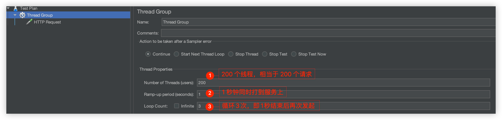

# Synchronized 锁-多机场景失效
先看一段模拟扣减库存的代码
```java
@RestController
public class RedisLockController {
    
    @Resource
    private StringRedisTemplate stringRedisTemplate;

    @RequestMapping("/deduct_stock")
    public String deductStock() {
        synchronized (this) {
            // 提前在redis服务上设置 300 个库存
            int stock = Integer.parseInt(stringRedisTemplate.opsForValue().get("stock"));
            if (stock > 0) {
                int realStock = stock - 1;
                // 重新设置缓存
                stringRedisTemplate.opsForValue().set("stock", realStock + "");
                System.out.println("扣减库存成功，剩余库存：" + realStock);
            } else {
                System.out.println("扣减库存失败，库存不足");
            }
            return String.valueOf(stock);
        }
    }
}
```
这段代码在单机的情况下是没问题的。但是目前的系统架构基本都是微服务多机，而 synchronized 锁是基于 JVM 级别，只能在当前机器中生效，多机环境下，
在高并发的情况下，这段代码是有问题的。

配置 nginx 代理，修改配置文件
```text
    upstream redislock{  # 代理的地址(物理机网卡 ip)
        server 192.168.0.200:8080 weight=1;
        server 192.168.0.200:8090 weight=1;
    }

    server {
        listen       80;
        server_name  localhost;

        #charset koi8-r;

        #access_log  logs/host.access.log  main;

        location / {
            root   html;
            index  index.html index.htm;
            proxy_pass  http://redislock;  # 代理的路径
        }
```

配置好后重新启动 nginx
```shell
nginx -s reload
```

然后配置不同的端口号，启动两个相同的服务，通过链接[扣减库存](http://10.211.55.3/deduct_stock) 访问服务，看看 nginx 是否代理生效(会将请求分发
到不同的服务器上)。测试结果：
```text
2023-03-07 10:11:41.371  INFO 59969 --- [           main] o.s.b.w.embedded.tomcat.TomcatWebServer  : Tomcat started on port(s): 8080 (http) with context path ''
2023-03-07 10:11:41.378  INFO 59969 --- [           main] c.anzhi.redislock.RedisLockApplication   : Started RedisLockApplication in 1.116 seconds (JVM running for 1.694)
2023-03-07 10:11:45.292  INFO 59969 --- [nio-8080-exec-1] o.a.c.c.C.[Tomcat].[localhost].[/]       : Initializing Spring DispatcherServlet 'dispatcherServlet'
2023-03-07 10:11:45.293  INFO 59969 --- [nio-8080-exec-1] o.s.web.servlet.DispatcherServlet        : Initializing Servlet 'dispatcherServlet'
2023-03-07 10:11:45.296  INFO 59969 --- [nio-8080-exec-1] o.s.web.servlet.DispatcherServlet        : Completed initialization in 3 ms
扣减库存成功，剩余库存：299
扣减库存成功，剩余库存：298
扣减库存成功，剩余库存：297


2023-03-07 19:30:01.061  INFO 62217 --- [           main] o.s.b.w.embedded.tomcat.TomcatWebServer  : Tomcat started on port(s): 8090 (http) with context path ''
2023-03-07 19:30:01.069  INFO 62217 --- [           main] c.anzhi.redislock.RedisLockApplication   : Started RedisLockApplication in 1.546 seconds (JVM running for 2.193)
2023-03-07 19:45:11.877  INFO 62217 --- [nio-8090-exec-1] o.a.c.c.C.[Tomcat].[localhost].[/]       : Initializing Spring DispatcherServlet 'dispatcherServlet'
2023-03-07 19:45:11.877  INFO 62217 --- [nio-8090-exec-1] o.s.web.servlet.DispatcherServlet        : Initializing Servlet 'dispatcherServlet'
2023-03-07 19:45:11.882  INFO 62217 --- [nio-8090-exec-1] o.s.web.servlet.DispatcherServlet        : Completed initialization in 5 ms
扣减库存成功，剩余库存：296
```

接下来使用 jmeter 模拟高并发来压测一下这段代码的问题：
1. 下载 Jmeter: [下载地址](https://dlcdn.apache.org//jmeter/binaries/apache-jmeter-5.5.tgz)
2. 下载完成之后，进行解压,然后为 jmeter 配置环境变量
```shell
# Jmeter Config
export JMETER_HOME=/Users/azh/Dev_AZH/Java_Env/apache-jmeter-5.5
# 配置环境生效
export PATH=$PATH:$JAVA_HOME/bin:$MAVEN_HOME/bin:$GRADLE_HOME/bin:$GH_MD_TOC/:$JMETER_HOME/bin

# 配置完成后保存，退出，使环境变量生效
source ~/.bash_profile

# 启动 Jmeter
jmeter
```
启动成功后会弹出一个 Jmeter 的操作界面，然后开始配置我们的压测：


具体页面配置如下：


在压测的时候尽量选择一个压测报告，可以实时监控压测的情况：


点击绿色运行按钮，开始压测，第一次需要你保存压测计划，保存完成之后，压测就开始了，下图是压测报告


8080 服务终端部分输出结果：
```text
扣减库存成功，剩余库存：299
扣减库存成功，剩余库存：298
扣减库存成功，剩余库存：297
扣减库存成功，剩余库存：294
扣减库存成功，剩余库存：293
扣减库存成功，剩余库存：291
扣减库存成功，剩余库存：290
扣减库存成功，剩余库存：287
扣减库存成功，剩余库存：286
扣减库存成功，剩余库存：284
扣减库存成功，剩余库存：283
扣减库存成功，剩余库存：281
扣减库存成功，剩余库存：278
扣减库存成功，剩余库存：277
扣减库存成功，剩余库存：276
扣减库存成功，剩余库存：274
```

8090 服务终端输出结果：
```text
扣减库存成功，剩余库存：296
扣减库存成功，剩余库存：295
扣减库存成功，剩余库存：294
扣减库存成功，剩余库存：293
扣减库存成功，剩余库存：292
扣减库存成功，剩余库存：291
扣减库存成功，剩余库存：290
扣减库存成功，剩余库存：289
扣减库存成功，剩余库存：288
扣减库存成功，剩余库存：287
扣减库存成功，剩余库存：286
扣减库存成功，剩余库存：285
扣减库存成功，剩余库存：284
扣减库存成功，剩余库存：283
扣减库存成功，剩余库存：282
扣减库存成功，剩余库存：281
```

仔细观察结果就会发现会有重复的库存出现。证明了 Synchronized 锁是无法保证多机情况下的并发安全。因此需要利用 redis 实现分布式锁。

# Redis 分布式锁
针对于上面的情况，还是需要引入 redis 服务进行枷锁。一般来说，针对并发量不是很大的情况下，我们设计分布式锁的时候设计大致如下：
1. 使用唯一值作为加锁条件，比如商品的 id；
2. 防止死锁的产生，需要给锁设置超时时间。以下情况会导致死锁的产生：
   1. 业务异常导致商品 id 加锁没有释放；
   2. redis 宕机导致锁没有释放；
3. 加锁时命令的原子性，即加锁和超时间设置是原子性的，不能被其他线程打断；

所以一个简单的 reids 分布式锁实现如下
```java
@RestController
public class RedisLockController {
    /**
     * redis 实现一个简单的分布式锁
     * @return
     */
    @RequestMapping("/deduct_stock_redislock")
    public String deductStockByRedisLock() {
        // 以商品 id 设置锁, 以及超时时间，防止宕机死锁。setIfAbsent 保证命令的原子性
        Boolean aBoolean = redisTemplate.opsForValue().setIfAbsent("product_Id_A", "product", 10, TimeUnit.SECONDS);
        // 如果设置锁失败，表明抢锁失败，业务上可以禁止下单或者返回一个错误码，让前端返回一个友好的提示
        if (Boolean.FALSE.equals(aBoolean)) {
            return "error_code";
        }

        // 捕获业务异常释放锁，防止死锁
        try {
            // 提前在redis服务上设置 300 个库存
            int stock = Integer.parseInt(stringRedisTemplate.opsForValue().get("stock"));
            if (stock > 0) {
                int realStock = stock - 1;
                // 重新设置缓存
                stringRedisTemplate.opsForValue().set("stock", realStock + "");
                System.out.println("扣减库存成功，剩余库存：" + realStock);
            } else {
                System.out.println("扣减库存失败，库存不足");
            }
            return String.valueOf(stock);
        } finally {
            redisTemplate.delete("product_Id_A");
        }
    }
}
```
上述就是一种比较简单的分布式锁的实现。

对于上面的代码还是存在问题，比如流量激增的情况下，这样会导致系统接口响应变慢。这样会导致锁被提前释放。场景如下：
1. 第一个线程执行时间超过了 10s，锁失效被释放。在并发的场景下，此时锁被其他线程获取，继续执行业务逻辑，然后在执行过程中，第一个线程执行完成，将第二个线程加的锁释放了；以此类推，极端情况下 
最终导致这个分布式锁形同虚设。
```java
/**
 * 针对于上述的情况有两个原因：
 * 1. 因为其他线程删除了不属于自己的分布式锁；那么根据这个思路可以为每一个线程分配它自己专属的标识，在删除 redis 锁的时候判断
 * 这把锁是否属于自己;
 * 2. 业务的执行时间不确定，锁超时导致锁被释放
 * 
 * 本质上还是因为业务执行时间不确定，导致锁超时释放。第一个可能是我们比较快速想到的一个方案，但是不是问题的本质。
 */
@RestController
public class RedisLockController {
   /**
    * redis 实现一个简单的分布式锁
    * @return
    */
   @RequestMapping("/deduct_stock_redislock")
   public String deductStockByRedisLock() {
      // 以商品 id 设置锁, 以及超时时间，防止宕机死锁。setIfAbsent 保证命令的原子性
      // 将商品名称用 UUID 替换，用来当作分布式锁的线程标识
      String clientId = UUID.randomUUID().toString();
      Boolean aBoolean = redisTemplate.opsForValue().setIfAbsent("product_Id_A",clientId, 10, TimeUnit.SECONDS);
      // 如果设置锁失败，表明抢锁失败，业务上可以禁止下单或者返回一个错误码，让前端返回一个友好的提示
      if(Boolean.FALSE.equals(aBoolean)){
         return "error_code";
      }

      // 捕获业务异常释放锁，防止死锁
      try {
         // 提前在redis服务上设置 300 个库存
         int stock = Integer.parseInt(stringRedisTemplate.opsForValue().get("stock"));
         if (stock > 0) {
            int realStock = stock - 1;
            // 重新设置缓存
            stringRedisTemplate.opsForValue().set("stock", realStock + "");
            System.out.println("扣减库存成功，剩余库存：" + realStock);
         } else {
            System.out.println("扣减库存失败，库存不足");
         }
         return String.valueOf(stock);
      }finally {
         if(clientId.equals(stringRedisTemplate.opsForValue().get("product_Id_A"))){
            redisTemplate.delete("product_Id_A");
         }
      }
   }
}
```
这样貌似解决了线程自己的锁被其他线程释放的问题，但是实际上还是存在问题。因为不知道你这个业务的确切执行时间，即使统计了日常的执行时间，但是
总是会出现非正常的情况导致锁超时，所以本质上问题仍然没有得到解决。

从上面的分析我们知道是因为业务执行时间很难判定，导致锁的超时时间无法设定。所以就可以这样考虑，需要一个监控，只要业务没有结束，那么在锁超时的
时候就需哟对锁续命。这个实现已经有大牛给实现了——RedisSon。

使用 Redisson 首先需要对 Redisson 进行配置连接，然后才能注入使用。在启动类中直接添加配置
```java
@SpringBootApplication
public class RedisLockApplication {
    public static void main(String[] args) {
        SpringApplication.run(RedisLockApplication.class, args);
    }
    
    // 配置 RedisSon
    @Bean
    public Redisson redisson(){
        Config config = new Config();
        // redis-cluster 连接 
        config.useClusterServers().addNodeAddress("redis://10.211.55.3:8001", "redis://10.211.55.5:8006")
                .addNodeAddress("redis://10.211.55.4:8003", "redis://10.211.55.3:8002")
                .addNodeAddress("redis://10.211.55.5:8005","redis://10.211.55.4:8004");

        return (Redisson) Redisson.create(config);
    }
}
```


# Redis 缓存数据冷热分离
1. 基本的冷热分离方案：针对于经常查询的数据，以商品为列。可以在将商品加入缓存的时候设置一个延期时间，每次查询一次就延长一次再缓存中的时间，
这样就会逐渐将热点数据和冷门儿数据慢慢地分离出来；