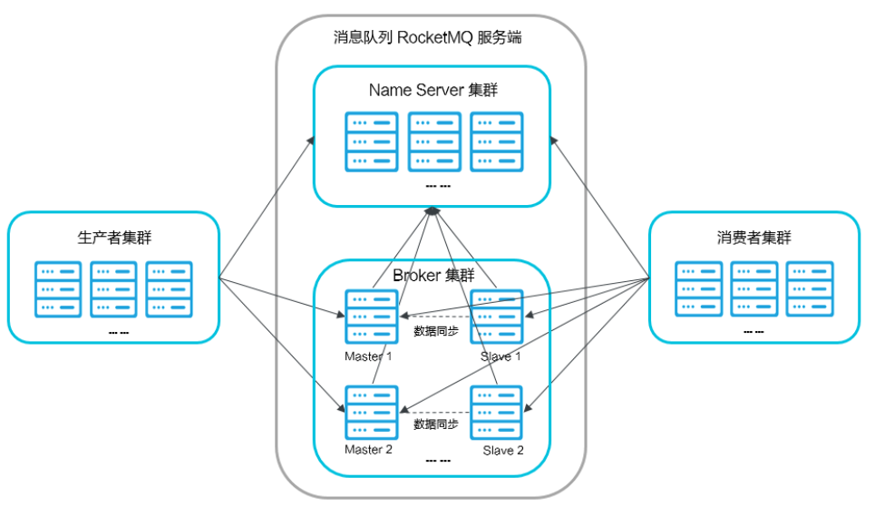

# RocketMQ 下载
下载地址：[4.9.1](https://github.com/apache/rocketmq/archive/refs/tags/rocketmq-all-4.9.1.tar.gz)

下载完成后解压文件：
```shell
tar -zxf rocketmq-all-4.9.1.tar.gz 
```

# 编译
目前RocketMQ的历史运行版本已经无法在官网下载，只能通过Github仓库下载 历史版本的源码，自行编译。

编译 RocketMQ 需要具备 mvn 环境。因为 RocketMQ 是由 Java 实现的 maven 工程。

下载 maven 包：
```shell
wget https://dlcdn.apache.org/maven/maven-3/3.6.3/binaries/apache-maven-3.6.3-bin.tar.gz --no-check-certificate
```
配置 mvn 环境
```shell
解压
tar -zxf apache-maven-3.6.3-bin.tar.gz 
# 配置 mvn 环境
vim ~/.bash_profile
# 配置环境
# Maven Home
export MVN_HOME=/root/Dev_Azh/mvn/apache-maven-3.6.3
export PATH=$PATH:$HOME/bin:$NGINX_HOME:$JAVA_HOME/bin:$NACOS_HOME/bin:$MVN_HOME/bin
# 使配置环境生效
source ~/.bash_profile
```

编译 RocketMQ
```shell
# 进入 RocketMQ 工程下
cd /root/Dev_Azh/rocketmq/rocketmq-rocketmq-all-4.9.1
# 开始编译
mvn -Prelease-all -DskipTests clean install -U
# 编译成功后显示如下：
[INFO] rocketmq-distribution 4.9.1 ........................ SUCCESS [03:07 min]
[INFO] ------------------------------------------------------------------------
[INFO] BUILD SUCCESS
[INFO] ------------------------------------------------------------------------
[INFO] Total time:  07:08 min
[INFO] Finished at: 2023-03-31T17:55:14-04:00
[INFO] ------------------------------------------------------------------------

# 最终生成的可执行文件放在了 RcoektMQ 工程的 distribution 目录下，bin 文件中存储的是启动文件：
rocketmq-rocketmq-all-4.9.1/distribution/target/rocketmq-4.9.1/rocketmq-4.9.1
# 配置 RocketMQ 的环境变量
vim ~/.bash_profile
# Rocket_Home 注意这个名称必须是 ROCKET_HOME, 路径是编译后的 rocketmq 的位置，不是源码的的位置
# ROCKET_HOME
export ROCKET_HOME=/root/Dev_Azh/rocketmq/rocketmq-rocketmq-all-4.9.1/distribution/target/rocketmq-4.9.1/rocketmq-4.9.1
```
# RocketMQ 工作原理
RocketMQ由以下这几个组件组成：
1. NameServer : 提供轻量级的Broker路由服务;
2. Broker:实际处理消息存储、转发等服务的核心组件;
3. Producer:消息生产者集群。通常是业务系统中的一个功能模块;
4. Consumer:消息消费者集群。通常也是业务系统中的一个功能模块;



所以我们要启动RocketMQ服务，需要先启动NameServer。

## NameServer服务搭建
启动NameServer非常简单，在$ROCKETMQ_HOME/bin目录下有个 mqadminsrv。直接执行这个脚本就可以启动RocketMQ的NameServer服务。

但是需要注意的是RocketMQ默认预设的JVM内存是4G，这是RocketMQ给我们的最佳配置。但是通常我们用虚拟机的话都是不够4G内存的，所以需要调整下
JVM内存大小。修改的方式是直接修改runserver.sh。 用vim runserver.sh编辑这个脚本，在脚本中找到这一行调整内存大小为512M
```shell
# 修改前：
JAVA_OPT="${JAVA_OPT} -server -Xms4g -Xmx4g -Xmn2g -XX:MetaspaceSize=128m -XX:MaxMetaspaceSize=320m"
# 修改后
JAVA_OPT="${JAVA_OPT} -server -Xms512m -Xmx512 -Xmn256m -XX:MetaspaceSize=128m -XX:MaxMetaspaceSize=320m"

# 修改前
JAVA_OPT="${JAVA_OPT} -server -Xms4g -Xmx4g -XX:MetaspaceSize=128m -XX:MaxMetaspaceSize=320m"
# 修改后
JAVA_OPT="${JAVA_OPT} -server -Xms512m -Xmx512m -XX:MetaspaceSize=128m -XX:MaxMetaspaceSize=320m"
```
然后使用静默方式启动 NameServer
```shell
# 配置日志文件存储位置
vim logback_namesrv.xml
# 将 ${user.home} 所在行路径改为自己的路径
# 接着启动 NameServer 服务
mqnamesrv &
# 查看日志输出如下信息表明启动成功：
2023-04-01 23:11:44 INFO main - Try to start service thread:FileWatchService started:false lastThread:null
2023-04-01 23:11:44 INFO NettyEventExecutor - NettyEventExecutor service started
2023-04-01 23:11:44 INFO main - The Name Server boot success. serializeType=JSON
# 关闭服务
mqshutdown namesrv
```
## Broker 搭服务搭建
启动 Broker 脚本的文件是runbroker.sh。Broker的默认预设内存是8G，启动前，如 果内存不够，同样需要调整下JVM内存。
```shell
# vim runbroker.sh
JAVA_OPT="${JAVA_OPT} -server -Xms512m -Xmx512m"
```
接着找到 broker.conf 文件，将自动创建 Topic 的选项设置为 true。 没有就新增
```shell
autoCreateTopicEnable=true
# 配置 broker 数据等存储路径
#存储路径
storePathRootDir=/root/Dev_Azh/rocketmq/store
```
配置完成后启动 broker 服务
```shell
mqbroker -c conf/broker.conf &
# 启动成功后输出信息
The broker[broker-a, 10.211.55.3:10911] boot success. serializeType=JSON
# 关闭服务
mqshutdown broker BrokerStartup
```

# RcoektMQ 集群搭建
一个完整的RocketMQ集群中，有如下几个角色
1. Producer:消息的发送者;举例:发信者;
2. Consumer:消息接收者;举例:收信者;
3. Broker:暂存和传输消息;举例:邮局
4. NameServer:管理Broker;举例:各个邮局的管理机构
5. Topic:区分消息的种类;一个发送者可以发送消息给一个或者多个Topic;一个 消息的接收者可以订阅一个或者多个Topic消息
6. Message Queue:相当于是Topic的分区;用于并行发送和接收消息

RocketMQ 支持的集群模式有以下几种：
1. 单 master：这是一种风险比较大的集群方式，因为一旦Borker重启或宕机期间，将会导致这个服务不可用，因此是不建议线上环境去使用的。
2. 多个Master：一个集群全部都是Master，没有Slave,它的优点和缺点如下：
    > 优点：配置简单，单个Master宕机或者是重启维护对应用没有什么影响的，在磁盘配置为RAID10时，即使机器宕机不可恢复的情况下，消息也不会丢失
    > （异步刷盘丢失少量消息，同步刷盘则是一条都不会丢失），性能最高;
    > 
    > 缺点：当单个Broker宕机期间，这台机器上未被消费的消息在机器恢复之前不可订阅，消息的实时性会受到影响。 
3. 多Master多Slave模式-异步复制:每个Master配置一个Slave,有多对的Master-Slave，HA采用的是异步复制方式，主备有短暂的消息延迟，毫秒级别的
（Master收到消息之后立刻向应用返回成功标识，同时向Slave写入消息）
   > 优点：即使是磁盘损坏了，消息丢失的非常少，且消息实时性不会受到影响，因为Master宕机之后，消费者仍然可以从Slave消费，此过程对应用透明，
   > 不需要人工干预，性能同多个Master模式几乎一样。
   > 
   > 缺点：Master宕机，磁盘损坏的情况下，会丢失少量的消息。 
4. 多Master多Slave模式-同步双写: 每个Master配置一个Slave,有多对的Master-Slave，HA采用的是同步双写模式，主备都写成功，才会向应用返回成功。
   > 优点：数据与服务都无单点，Master宕机的情况下，消息无延迟，服务可用性与数据可用性都非常高
   > 缺点：性能比异步复制模式略低，大约低10%左右，发送单个Master的RT会略高，目前主机宕机后，Slave不能自动切换为主机，后续会支持自动切换功能。
5. RocketMQ-on-DLedger Group（可自动主从容灾）: 之前的几种方式，能解决数据冗余备份，一定高可用问题。但是master故障后，slave 可以继续提供
消费数据。但是生产数据呢？这会导致生产服务中断不可用。所以又出现了RocketMQ-on-DLedger Group架构。可自主容灾。因此引入了DLedger工具。

## rocketmq高可用集群部署（RocketMQ-on-DLedger Group）
首先要准备三台主机 10.211.55.3、10.211.55.4、10.211.55.5。接着开始准备配置:

因为 NameServer 之间相互不通讯，所以，首先将三台机器的 NameServer 注册中心先启动起来。

接着开始配置 broker。该配置文件在 distribution/target/rocketmq-4.9.1/rocketmq-4.9.1/conf/dledger 下。

10.211.55.3 配置:
```shell
# 编辑文件
vim broker-n0.conf 

# 编辑后内容如下：
brokerClusterName = RaftCluster
brokerName=RaftNode00
listenPort=30911
namesrvAddr=127.0.0.1:9876
storePathRootDir=/root/Dev_Azh/rocketmq/rmqstore/node00
storePathCommitLog=/root/Dev_Azh/rocketmq/rmqstore/node00/commitlog
enableDLegerCommitLog=true
dLegerGroup=RaftNode00
dLegerPeers=n0-127.0.0.1:40911;n1-127.0.0.1:40912;n2-127.0.0.1:40913
## must be unique
dLegerSelfId=n0
sendMessageThreadPoolNums=16
```

10.211.55.4 配置：
```shell
# 编辑文件
vim broker-n1.conf 

# 编辑后内容如下：
brokerClusterName = RaftCluster
brokerName=RaftNode00
listenPort=30921
namesrvAddr=10.211.55.3:9876;10.211.55.4:9876;10.211.55.5:9876
storePathRootDir=/root/Dev_Azh/rocketmq/rmqstore/node01
storePathCommitLog=/root/Dev_Azh/rocketmq/rmqstore/node01/commitlog
enableDLegerCommitLog=true
dLegerGroup=RaftNode00
dLegerPeers=n0-10.211.55.3:40911;n1-10.211.55.4:40912;n2-10.211.55.5:40913
## must be unique
dLegerSelfId=n1
sendMessageThreadPoolNums=16
```
10.211.55.5 配置：
```shell
# 编辑文件
vim broker-n1.conf 

# 编辑后内容如下：
brokerClusterName = RaftCluster
brokerName=RaftNode00
listenPort=30931
namesrvAddr=10.211.55.3:9876;10.211.55.4:9876;10.211.55.5:9876
storePathRootDir=/root/Dev_Azh/rocketmq/node02
storePathCommitLog=/root/Dev_Azh/rocketmq/node02/commitlog
enableDLegerCommitLog=true
dLegerGroup=RaftNode00
dLegerPeers=n0-10.211.55.3:40911;n1-10.211.55.4:40912;n2-10.211.55.5:40913
## must be unique
dLegerSelfId=n2
sendMessageThreadPoolNums=16
```
然后分别启动三台机器上的 broker 服务。
```shell
# 10.211.55.3
mqbroker -c /root/Dev_Azh/rocketmq/rocketmq-rocketmq-all-4.9.1/distribution/target/rocketmq-4.9.1/rocketmq-4.9.1/conf/dledger/broker-n0.conf &
# 10.211.55.4
mqbroker -c /root/Dev_Azh/rocketmq/rocketmq-rocketmq-all-4.9.1/distribution/target/rocketmq-4.9.1/rocketmq-4.9.1/conf/dledger/broker-n1.conf &
# 10.211.55.5
mqbroker -c /root/Dev_Azh/rocketmq/rocketmq-rocketmq-all-4.9.1/distribution/target/rocketmq-4.9.1/rocketmq-4.9.1/conf/dledger/broker-n2.conf &
```
如果嫌弃文件太长的话，可以设置快捷键命令，在环境变量中配置：
```shell
vim ~/.bash_profile
# 添加命令：
alias mqbroker-dledger='mqbroker -c /root/Dev_Azh/rocketmq/rocketmq-rocketmq-all-4.9.1/distribution/target/rocketmq-4.9.1/rocketmq-4.9.1/conf/dledger/broker-n2.conf &'
```
这样后续直接运行 mqbroker-dledger 命令即可。

都启动完成之后，可以通过命令查看是否搭建成功：
```shell
sh bin/mqadmin clusterList -n 10.211.55.3:9876
# 输出信息
#Cluster Name     #Broker Name            #BID  #Addr                  #Version                #InTPS(LOAD)       #OutTPS(LOAD) #PCWait(ms) #Hour #SPACE
RaftCluster       RaftNode00              0     10.211.55.4:30921      V4_9_1                   0.00(0,0ms)         0.00(0,0ms)          0 466789.37 -1.0000
RaftCluster       RaftNode00              1     10.211.55.3:30911      V4_9_1                   0.00(0,0ms)         0.00(0,0ms)          0 466789.37 -1.0000
RaftCluster       RaftNode00              3     10.211.55.5:30931      V4_9_1                   0.00(0,0ms)         0.00(0,0ms)          0 466789.37 -1.0000
```

# 安装rocketmq-console的web管理页面(rocketmq-dashboard)
> note: 新版本rocketmq-console已经改名叫rocketmq-dashboard。

通过安装 rocketmq-console 可视化界面，可以更加直观、方便地操作 RocketMQ 集群。下载地址：
```shell
wget https://github.com/apache/rocketmq-dashboard/archive/refs/tags/rocketmq-dashboard-1.0.0.tar.gz
# 使用 mvn 编译
mvn clean package -Dmaven.test.skip=true
# 构建成功后输出如下信息
Downloaded from nexus-aliyun: http://maven.aliyun.com/nexus/content/groups/public/org/vafer/jdependency/2.1.1/jdependency-2.1.1.jar (186 kB at 48 kB/s)
[INFO] Replacing main artifact with repackaged archive
[INFO] ------------------------------------------------------------------------
[INFO] BUILD SUCCESS
[INFO] ------------------------------------------------------------------------
[INFO] Total time:  43.466 s
[INFO] Finished at: 2023-04-02T10:20:51-04:00
[INFO] ------------------------------------------------------------------------
```
编译完成后生成的 jar 包在 target 下。运行 jar 包
```shell
java -jar rocketmq-dashboard-1.0.0.jar --rocketmq.config.namesrvAddr="10.211.55.3:9876;10.211.55.4:9876;10.211.55.5:9876" --server.port=8080
# 启动输出如下信息
RocketMQLog:WARN Please initialize the logger system properly.
[2023-04-02 10:39:00.169]  INFO create MQAdmin instance ClientConfig [namesrvAddr=10.211.55.3:9876;10.211.55.4:9876;10.211.55.5:9876, clientIP=10.211.55.3, instanceName=1680446340012, clientCallbackExecutorThreads=2, pollNameServerInterval=30000, heartbeatBrokerInterval=30000, persistConsumerOffsetInterval=5000, pullTimeDelayMillsWhenException=1000, unitMode=false, unitName=null, vipChannelEnabled=true, useTLS=false, language=JAVA, namespace=null] success.
```
通过地址 http://10.211.55.3:8080 访问，查看集群 Cluster 如图：

可以看到一主两从。尝试将主节点 down 掉，看看是否会自动转换主节点。

可以看到主节点从原来的 10.211.55.4 变成了 10.211.55.3。集群搭建成功。


