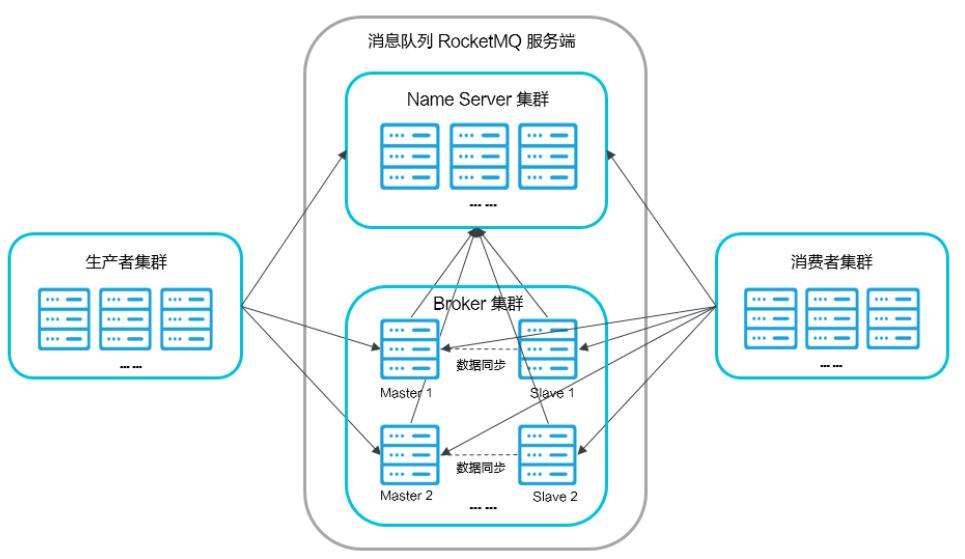

# RocketMQ 下载
下载地址：[4.9.1](https://github.com/apache/rocketmq/archive/refs/tags/rocketmq-all-4.9.1.tar.gz)

下载完成后解压文件：
```shell
tar -zxf rocketmq-all-4.9.1.tar.gz 
```

# 编译
目前RocketMQ的历史运行版本已经无法在官网下载，只能通过Github仓库下载 历史版本的源码，自行编译。

编译 RocketMQ 需要具备 mvn 环境。因为 RocketMQ 是由 Java 实现的 maven 工程。

下载 maven 包：
```shell
wget https://dlcdn.apache.org/maven/maven-3/3.6.3/binaries/apache-maven-3.6.3-bin.tar.gz --no-check-certificate
```
配置 mvn 环境
```shell
解压
tar -zxf apache-maven-3.6.3-bin.tar.gz 
# 配置 mvn 环境
vim ~/.bash_profile
# 配置环境
# Maven Home
export MVN_HOME=/root/Dev_Azh/mvn/apache-maven-3.6.3
export PATH=$PATH:$HOME/bin:$NGINX_HOME:$JAVA_HOME/bin:$NACOS_HOME/bin:$MVN_HOME/bin
# 使配置环境生效
source ~/.bash_profile
```

编译 RocketMQ
```shell
# 进入 RocketMQ 工程下
cd /root/Dev_Azh/rocketmq/rocketmq-rocketmq-all-4.9.1
# 开始编译
mvn -Prelease-all -DskipTests clean install -U
# 编译成功后显示如下：
[INFO] rocketmq-distribution 4.9.1 ........................ SUCCESS [03:07 min]
[INFO] ------------------------------------------------------------------------
[INFO] BUILD SUCCESS
[INFO] ------------------------------------------------------------------------
[INFO] Total time:  07:08 min
[INFO] Finished at: 2023-03-31T17:55:14-04:00
[INFO] ------------------------------------------------------------------------

# 最终生成的可执行文件放在了 RcoektMQ 工程的 distribution 目录下，bin 文件中存储的是启动文件：
rocketmq-rocketmq-all-4.9.1/distribution/target/rocketmq-4.9.1/rocketmq-4.9.1
# 配置 RocketMQ 的环境变量
vim ~/.bash_profile
# Rocket_Home 注意这个名称必须是 ROCKET_HOME, 路径是编译后的 rocketmq 的位置，不是源码的的位置
# ROCKET_HOME
export ROCKET_HOME=/root/Dev_Azh/rocketmq/rocketmq-rocketmq-all-4.9.1/distribution/target/rocketmq-4.9.1/rocketmq-4.9.1
```
# RocketMQ 工作原理
RocketMQ由以下这几个组件组成：
1. NameServer : 提供轻量级的Broker路由服务;
2. Broker:实际处理消息存储、转发等服务的核心组件;
3. Producer:消息生产者集群。通常是业务系统中的一个功能模块;
4. Consumer:消息消费者集群。通常也是业务系统中的一个功能模块;



所以我们要启动RocketMQ服务，需要先启动NameServer。

## NameServer服务搭建
启动NameServer非常简单，在$ROCKETMQ_HOME/bin目录下有个 mqadminsrv。直接执行这个脚本就可以启动RocketMQ的NameServer服务。

但是需要注意的是RocketMQ默认预设的JVM内存是4G，这是RocketMQ给我们的最佳配置。但是通常我们用虚拟机的话都是不够4G内存的，所以需要调整下
JVM内存大小。修改的方式是直接修改runserver.sh。 用vim runserver.sh编辑这个脚本，在脚本中找到这一行调整内存大小为512M
```shell
# 修改前：
JAVA_OPT="${JAVA_OPT} -server -Xms4g -Xmx4g -Xmn2g -XX:MetaspaceSize=128m -XX:MaxMetaspaceSize=320m"
# 修改后
JAVA_OPT="${JAVA_OPT} -server -Xms512m -Xmx512 -Xmn256m -XX:MetaspaceSize=128m -XX:MaxMetaspaceSize=320m"

# 修改前
JAVA_OPT="${JAVA_OPT} -server -Xms4g -Xmx4g -XX:MetaspaceSize=128m -XX:MaxMetaspaceSize=320m"
# 修改后
JAVA_OPT="${JAVA_OPT} -server -Xms512m -Xmx512m -XX:MetaspaceSize=128m -XX:MaxMetaspaceSize=320m"
```
然后使用静默方式启动 NameServer
```shell
# 配置日志文件存储位置
vim logback_namesrv.xml
# 将 ${user.home} 所在行路径改为自己的路径
# 接着启动 NameServer 服务
mqnamesrv &
# 查看日志输出如下信息表明启动成功：
2023-04-01 23:11:44 INFO main - Try to start service thread:FileWatchService started:false lastThread:null
2023-04-01 23:11:44 INFO NettyEventExecutor - NettyEventExecutor service started
2023-04-01 23:11:44 INFO main - The Name Server boot success. serializeType=JSON
# 关闭服务
mqshutdown namesrv
```


