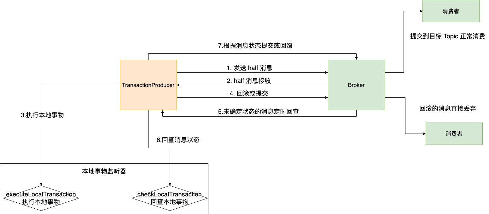

# 开发环境搭建
首先创建一个基于 Maven 的SpringBoot 工程。并引入依赖：
```xml
<dependency>
    <groupId>org.apache.rocketmq</groupId>
    <artifactId>rocketmq-client</artifactId>
    <version>4.9.1</version>
</dependency>
```
# RocketMQ 消息样例
## 基本样例
使用消息生产者分别通过三种方式发送消息，同步发送、异步 发送以及单向发送。 然后使用消费者来消费这些消息。

定义连接地址
```java
public class Constant {
    public final static String NAMESERVER = "10.211.55.3:9876;10.211.55.4:9876;10.211.55.5:9876";
}
```
### 单向发送消息的样例:
```java
public class RocketMQAPIOnewayProducer {
    public static void main(String[] args) throws Exception{
        DefaultMQProducer producer = new DefaultMQProducer("TopicOneway_Group");
        producer.setNamesrvAddr(Constant.NAMESERVER);
        producer.start();

        for(int i=0; i<10; i++){
            Message msg = new Message("TopicOneway",
                    "TagA",
                    ("Hello RocketMQ" +i).getBytes(RemotingHelper.DEFAULT_CHARSET));
            producer.sendOneway(msg);
            System.out.println("发送消息完成");
        }
        Thread.sleep(5000);
        System.out.println("关闭 producer");
        producer.shutdown();
    }
}
```

生产者只要把消息发送完成即可，不关心其他事情。

### 异步发送消息
```java
public class RocketMQAPIAsyncProducer {
    public static void main(String[] args) throws Exception{
        DefaultMQProducer producer = new DefaultMQProducer("As_Sync_Producer");
        producer.setNamesrvAddr(Constant.NAMESERVER);
        producer.start();
        // 消息重试次数
        producer.setRetryTimesWhenSendAsyncFailed(0);
        //设置大的话，会抛错broker busy，因为Broker在追加消息时，持有的锁超过了200ms, 怎么解决？？？
        // 10没问题，100会导致队列中的任务等待时间超过200ms，此时会触发broker端的快速失败
        // 具体详见：https://blog.csdn.net/prestigeding/article/details/102714973
        int messageCount = 10;
        //由于是异步发送，这里引入一个countDownLatch，保证所有Producer发送消息的回调方法都执行完了再停止Producer服务。
        final CountDownLatch countDownLatch = new CountDownLatch(messageCount);
        for(int i=0; i<messageCount; i++) {
            try {
                final int index = i;
                Message msg = new Message("TopicTestAsync",
                        "TagA",
                        "ordId188",
                        "Hello World".getBytes(RemotingHelper.DEFAULT_CHARSET));
                producer.send(msg, new SendCallback() {
                    // 当 Broker 接收到 Producer 消息，表示消息发送成功，此时会回掉 onSuccess
                    @Override
                    public void onSuccess(SendResult sendResult) {
                        countDownLatch.countDown();
                        System.out.printf("%-10d ok %s %n", index, sendResult.getMsgId());
                    }
                    // 失败则回掉 onException 方法
                    @Override
                    public void onException(Throwable e) {
                        countDownLatch.countDown();
                        System.out.printf("%-10d Exception %s %n", index, e);
                        e.printStackTrace();
                    }
                });
                System.out.println("消息发送完成");
            }catch (Exception e){
                e.printStackTrace();
            }
        }
        countDownLatch.await(5, TimeUnit.SECONDS);
        producer.shutdown();
    }
}
```
### 同步消息发送
```java
public class RocketMQAPIProducer {
    public final static String NAMESERVER = "10.211.5.3:9876;10.211.5.4:9876;10.211.5.5:9876";

    public static void main(String[] args) throws Exception{
        // 使用生产者组名称实例化。
        DefaultMQProducer producer = new DefaultMQProducer("please_rename_unique_group_name");
        // 指定nameServer地址
        producer.setNamesrvAddr(NAMESERVER);
        //启动生产者
        producer.start();
        for(int i=0; i<100; i++){
            //创建信息实体，指定主题，目标，和消息正文
            Message msg = new Message("TopicTest" /* Topic */,"TagA" /* Tag */,("Hello RocketMQ " + i)
                    .getBytes(RemotingHelper.DEFAULT_CHARSET)
            );

            //调用 send message 将消息发送给消息处理中心Broker, Broker 会返回一个消息状态给 Producer
            SendResult result = producer.send(msg);
            SendStatus sendStatus = result.getSendStatus();
            System.out.println(sendStatus);
            System.out.println("消息发出"+result);
        }

        Thread.sleep(5000);
        producer.shutdown();
    }
}
```

## 顺序消息
```java
public class Producer {
    public static void main(String[] args) throws UnsupportedEncodingException {
        DefaultMQProducer producer = new DefaultMQProducer("please_rename_unique_group_name");
        try {
            producer.setNamesrvAddr(Constant.NAMESERVER);
            producer.start();

            for(int i=0; i<10; i++){
                int orderId = i;

                for(int j=0; j<=5; j++){
                    Message msg = new Message("OrderTopicTest", "order_"+orderId, "KEY"+orderId,
                            ("order_"+orderId+" step "+ j).getBytes(RemotingHelper.DEFAULT_CHARSET));
                    System.out.println("发送的消息内容为-》{"+new String(msg.getBody()) + "}");
                    SendResult sendResult = producer.send(msg, new MessageQueueSelector() {
                        @Override
                        public MessageQueue select(List<MessageQueue> mqs, Message msg, Object arg) {
                            // 将相同orderId的消息放入同一个队列
                            Integer id = (Integer) arg;
                            int index = id % mqs.size();
                            return mqs.get(index);
                        }
                    }, orderId);
                    System.out.printf("%s%n", sendResult);
                }
            }
            producer.shutdown();
        }catch (MQClientException | RemotingException | MQBrokerException | InterruptedException e){
            e.printStackTrace();
        }
    }
}
```

运行生产者发送消息, 输出信息为：
```text
发送的消息内容为-》{order_0 step 0}
SendResult [sendStatus=SEND_OK, msgId=7F000001EA36512DDF1718BE0DC50000, offsetMsgId=0AD33704000078C9000000000000DE24, messageQueue=MessageQueue [topic=OrderTopicTest, brokerName=RaftNode00, queueId=0], queueOffset=0]
发送的消息内容为-》{order_0 step 1}
SendResult [sendStatus=SEND_OK, msgId=7F000001EA36512DDF1718BE0DE40001, offsetMsgId=0AD33704000078C9000000000000DF1F, messageQueue=MessageQueue [topic=OrderTopicTest, brokerName=RaftNode00, queueId=0], queueOffset=1]
发送的消息内容为-》{order_0 step 2}
SendResult [sendStatus=SEND_OK, msgId=7F000001EA36512DDF1718BE0DE80002, offsetMsgId=0AD33704000078C9000000000000E01A, messageQueue=MessageQueue [topic=OrderTopicTest, brokerName=RaftNode00, queueId=0], queueOffset=2]
发送的消息内容为-》{order_0 step 3}
SendResult [sendStatus=SEND_OK, msgId=7F000001EA36512DDF1718BE0DEE0003, offsetMsgId=0AD33704000078C9000000000000E115, messageQueue=MessageQueue [topic=OrderTopicTest, brokerName=RaftNode00, queueId=0], queueOffset=3]
发送的消息内容为-》{order_0 step 4}
SendResult [sendStatus=SEND_OK, msgId=7F000001EA36512DDF1718BE0DF20004, offsetMsgId=0AD33704000078C9000000000000E210, messageQueue=MessageQueue [topic=OrderTopicTest, brokerName=RaftNode00, queueId=0], queueOffset=4]
发送的消息内容为-》{order_0 step 5}
····
```

Consumer 顺序消费
```java
public class Consumer {
    public static void main(String[] args) throws MQClientException {
        DefaultMQPushConsumer consumer = new DefaultMQPushConsumer("please_rename_unique_group_name_3");
        consumer.setNamesrvAddr(Constant.NAMESERVER);
        // 设置消费者从哪里开始消费
        consumer.setConsumeFromWhere(ConsumeFromWhere.CONSUME_FROM_LAST_OFFSET);
        consumer.subscribe("OrderTopicTest", "*");

        consumer.registerMessageListener(new MessageListenerOrderly() {
            @Override
            public ConsumeOrderlyStatus consumeMessage(List<MessageExt> msgs, ConsumeOrderlyContext context) {
                //context.setAutoCommit(true);
                for(MessageExt msg:msgs){
                    System.out.println("收到消息内容 "+new String(msg.getBody()));
                }
                return ConsumeOrderlyStatus.SUCCESS;
            }
        });

        consumer.start();
        System.out.printf("Consumer Started.%n");
    }
}
```

运行消费者程序，消费信息如下：
```text
Consumer Started.
收到消息内容 order_1 step 0
收到消息内容 order_0 step 0
收到消息内容 order_3 step 0
收到消息内容 order_2 step 0
收到消息内容 order_0 step 1
收到消息内容 order_1 step 1
收到消息内容 order_2 step 1
收到消息内容 order_0 step 2
收到消息内容 order_3 step 1
收到消息内容 order_2 step 2
收到消息内容 order_1 step 2
收到消息内容 order_3 step 2
收到消息内容 order_1 step 3
收到消息内容 order_2 step 3
收到消息内容 order_0 step 3
收到消息内容 order_2 step 4
收到消息内容 order_1 step 4
收到消息内容 order_3 step 3
收到消息内容 order_2 step 5
收到消息内容 order_0 step 4
收到消息内容 order_3 step 4
收到消息内容 order_0 step 5
```
可以看到每个订单的顺序是顺序消费，但是整体的订单消费顺序是无序的。

因此RocketMQ保证的是消息的局部有序，而不是全局有序。

从上面案例可以看到，首先是保证了消费端的有序，即将相同订单的业务放到了一个 queue 中，在 Broker 的一个队列中是可以保证消息有序的；

在消费者端，消费者会从多个消息队列上去拿消息。这时虽然每个 消息队列上的消息是有序的，但是多个队列之间的消息仍然是乱序的。 消费者端要保证消
息有序，就需要按队列一个一个来取消息，即取完一个队列的消息后，再去取下一个队列的消息。而给consumer注入的 MessageListenerOrderly 对象，
在RocketMQ内部就会通过锁队列的方式保证消息是一个一个队列来取的，因此保证了消费队列的有序。MessageListenerConcurrently这个消息监听器则
不会锁队列，每次都是从多个Message中取一批数据 (默认不超过32条)，因此也无法保证消息有序。

##  广播消息
广播模式则是把消息发给了所有订阅了对应主题的消费者，而不管消费者是不是同一个消费者组。
```javapublic class PushConsumer {

    public static void main(String[] args) throws InterruptedException, MQClientException {
        DefaultMQPushConsumer consumer = new DefaultMQPushConsumer("order_msg");
        consumer.setConsumeFromWhere(ConsumeFromWhere.CONSUME_FROM_LAST_OFFSET);
        // 设置消费者的消费模式
        consumer.setMessageModel(MessageModel.BROADCASTING);
        consumer.subscribe("OrderTopicTest", "*");

        consumer.setNamesrvAddr(Constant.NAMESERVER);

        consumer.registerMessageListener(new MessageListenerConcurrently() {
            @Override
            public ConsumeConcurrentlyStatus consumeMessage(List<MessageExt> msgs, ConsumeConcurrentlyContext context) {
                for(int i=0; i<msgs.size(); i++) {
                    System.out.printf("Recive New Message: %s %n", new String(msgs.get(i).getBody()));
                }
                return ConsumeConcurrentlyStatus.CONSUME_SUCCESS;
            }
        });
        consumer.start();
        System.out.printf("Broadcast Consumer Started. %n");
    }
}
```

## 延迟消息
```java
public class ScheduledMessageProducer {
    public static void main(String[] args) throws Exception {
        DefaultMQProducer defaultMQProducer = new DefaultMQProducer("ExampleProducerGroup");
        defaultMQProducer.setNamesrvAddr(Constant.NAMESERVER);

        defaultMQProducer.start();
        int totalMessageTosend = 100;

        for(int i=0; i<totalMessageTosend; i++){
            Message message = new Message("TestTopic2", ("Hello scheduled message" + i).getBytes());

            // 设置延时级别
            message.setDelayTimeLevel(3);

            defaultMQProducer.send(message);
        }
        defaultMQProducer.shutdown();
    }
}
```
延迟消息实现的效果就是在调用producer.send方法后，消息并不会立 即发送出去，而是会等一段时间再发送出去。这是RocketMQ特有的一 个功能。

## 批量消息
批量消息是指将多条消息合并成一个批量消息，一次发送出去。这样的好处是可以 减少网络IO，提升吞吐量。
```java
public class SplitBatchProducer {
    public static void main(String[] args) throws Exception{
        DefaultMQProducer producer = new DefaultMQProducer("BatchProducerGroupName");
        //producer.setNamesrvAddr(Constant.NAMESERVER);
        producer.setNamesrvAddr("192.168.40.128:9876");
        producer.start();

        // large batch
        String topic = "BatchTest";

        Integer capacity = 100 * 1000;
        List<Message> messages = new ArrayList<>(capacity);
        for(int i=0; i<capacity; i++){
            messages.add(new Message(topic,"Tag", "OrderId_"+i, ("Hello MQ" + i).getBytes()));
        }

        //producer.send(messages);  //直接发送会导致MQClientException，CODE: 13  DESC: the message body size over max value, MAX: 4194304
        //split the large batch into small ones:
        ListSplitter splitter = new ListSplitter(messages);
        while (splitter.hasNext()){
            List<Message> listItem = splitter.next();
            SendResult send = producer.send(listItem);
            System.out.printf("%s%n", send);
        }
        System.out.println("消息发送完毕, 关闭消费者");
        producer.shutdown();
    }
}
```

## 过滤消息
在大多数情况下，可以使用Message的Tag属性来简单快速的过滤信息。
```java
public class SqlFilterProducer {
    public static void main(String[] args) throws Exception{
        DefaultMQProducer producer = new DefaultMQProducer("please_rename_unique_group_name");
        producer.setNamesrvAddr(Constant.NAMESERVER);
        producer.start();

        String[] tags = new String[] {"TagA", "TagB", "TagC"};
        for(int i=0; i<15; i++){
            Message msg = new Message("SqlFiltertest", tags[i % tags.length], ("hello filter sql").
                    getBytes(RemotingHelper.DEFAULT_CHARSET));
            msg.putUserProperty("a", String.valueOf(i));

            SendResult sendResult = producer.send(msg);
            System.out.printf("%s%n", sendResult);
        }

        producer.shutdown();
    }
}
```
消费者
```java
public class SqlFilterConsumer {
    public static void main(String[] args) throws Exception{
        DefaultMQPushConsumer consumer = new DefaultMQPushConsumer("please_rename_unique_group_name");

        // Don't forget to set enablePropertyFilter=true in broker
        consumer.subscribe("SqlFiltertest", MessageSelector.bySql("TAGS is not null and TAGS in ('TagA', 'TagB'))" +
                "and (a is not null and a between 0 and 3)"));

        consumer.registerMessageListener(new MessageListenerConcurrently() {
            @Override
            public ConsumeConcurrentlyStatus consumeMessage(List<MessageExt> msgs, ConsumeConcurrentlyContext context) {
                System.out.printf("%s Recive New Message: %s %n", Thread.currentThread().getName(), msgs);
                return ConsumeConcurrentlyStatus.CONSUME_SUCCESS;
            }
        });

        consumer.setNamesrvAddr(Constant.NAMESERVER);
        consumer.start();
        System.out.println("Consumer Started. %n");
    }
}
```

## 事务消息
事务消息是在分布式系统中保证最终一致性的两阶段提交的消息实现。他可以保证本地事务执行与消息发送两个操作的原子性，也就是这两个操作一起成功
或者一起失败。

事务消息只保证消息发送者的本地事 务与发消息这两个操作的原子性，因此，事务消息的示例只涉及到消息发送者，对于消息消费者来说，并没有什么特别的。
```java
public class TransactionProducer {
    public static void main(String[] args) throws MQClientException, InterruptedException{
        TransactionListener transactionListener = new TransactionListenerImpl();
        TransactionMQProducer producer = new TransactionMQProducer("please_rename_unique_group_name");
        producer.setNamesrvAddr(Constant.NAMESERVER);
        ExecutorService executorService = new ThreadPoolExecutor(2, 5, 100, TimeUnit.SECONDS, new ArrayBlockingQueue<Runnable>(2000),
                new ThreadFactory() {
                    @Override
                    public Thread newThread(Runnable r) {
                        Thread thread = new Thread(r);
                        thread.setName("client-transaction-msg-check-thread");
                        return thread;
                    }
                });
        producer.setExecutorService(executorService);
        producer.setTransactionListener(transactionListener);
        producer.start();

        String[] tags = new String[]{"TagA", "TagB", "TagC", "TagD", "TagE"};
        for(int i=0; i<10; i++){
            try{
                Message msg = new Message("TopicTest", tags[i % tags.length], "KEY" + i, ("Hello Trans" +i).
                        getBytes(RemotingHelper.DEFAULT_CHARSET));
                SendResult sendResult = producer.sendMessageInTransaction(msg, null);
                System.out.printf("%s%n", sendResult);
                Thread.sleep(10);
            }catch (MQClientException | UnsupportedEncodingException e){
                e.printStackTrace();
            }

            for(int j=0; j<100000; j++){
                Thread.sleep(1000);
            }
            producer.shutdown();
        }
    }
}
```
```java
public class TransactionListenerImpl implements TransactionListener {
    // 在提交完事物消息后执行
    // 返回COMMIT_MESAGE状态的消息会立即被消费者消费到
    // 返回ROLLBACK_MESSAGE状态的消息会被丢弃
    // 返回UNKNOW状态的消息会由Broker过一段时间在来回查事物状态
    @Override
    public LocalTransactionState executeLocalTransaction(Message msg, Object arg) {
        String tags = msg.getTags();
        // TagA的消息会立即被消费者消费到
        if(StringUtils.contains(tags, "TagA")){
            return LocalTransactionState.COMMIT_MESSAGE;
            // TagB的消息会被丢弃
        }else if(StringUtils.contains(tags, "TagB")){
            return LocalTransactionState.ROLLBACK_MESSAGE;
            // 其他消息会等待Broker进行事物状态回查
        }else{
            return LocalTransactionState.UNKNOW;
        }
    }

    // 在对UNKNOW状态的消息进行状态回查时执行。返回的结果是一样的。
    @Override
    public LocalTransactionState checkLocalTransaction(MessageExt msg) {
        String tags = msg.getTags();
        // TagC 的消息过一段时间会被消费者消费到
        if(StringUtils.contains(tags, "TagC")){
            return LocalTransactionState.COMMIT_MESSAGE;
            // TagD的消息也会在状态回查时被丢弃掉
        }else if(StringUtils.contains(tags, "TagD")){
            return LocalTransactionState.ROLLBACK_MESSAGE;
            // 剩下的TagE消息会在多次状态回查后最终丢弃
        }else{
            return LocalTransactionState.UNKNOW;
        }
    }
}
```
### 事物消息的使用限制
1. 事务消息不支持延迟消息和批量消息。
2. 为了避免单个消息被检查太多次而导致半队列消息累积，我们默认将单个消息的检查次数限制为 15 次，但是用户可以通过 Broker 配置文件的 transactionCheckMax
   参数来修改此限制。如果已经检查某条消息超过 N 次的话 ( N = transactionCheckMax ) 则 Broker 将丢弃此消息。并在默认情况下同时打印错误日志。
   用户可以通过重写 AbstractTransactionCheckListener 类来修改这个行为；
3. 事务消息将在 Broker 配置文件中的参数 transactionMsgTimeout 这样的特定时间长度之后被检查。当发送事务消息时，用户还可以通过设置用户
   属性 CHECK_IMMUNITY_TIME_IN_SECONDS 来改变这个限制，该参数优先于 transactionMsgTimeout 参数。
4. 事务性消息可能不止一次被检查或消费。
5. 提交给用户的目标主题消息可能会失败，目前这依日志的记录而定。它的高可用性通过 RocketMQ 本身的高可用性机制来保证，如果希望确保事务消息不丢失、
   并且事务完整性得到保证，建议使用同步的双重写入机制。
6. 事务消息的生产者 ID 不能与其他类型消息的生产者 ID 共享。与其他类型的消息不同，事务消息允许反向查询、MQ服务器能通过它们的生产者 ID 查询到消费者。

### 消息事物的实现机制


事务消息发送步骤如下：

1. 发送方将半事务消息发送至消息队列 RocketMQ 版服务端。
2. 消息队列 RocketMQ 版服务端将消息持久化成功之后，向发送方返回 Ack 确认消息已经发送成功，此时消息为半事务消息。 
3. 发送方开始执行本地事务逻辑。 
4. 发送方根据本地事务执行结果向服务端提交二次确认（Commit 或是 Rollback），服务端收到 Commit 状态则将半事务消息标记为可投递，订阅方最
   终将收到该消息；服务端收到 Rollback 状态则删除半事务消息，订阅方将不会接受该消息。事务消息回查步骤如下： 
5. 在断网或者是应用重启的特殊情况下，上述步骤 4 提交的二次确认最终未到达服务端，经过固定时间后服务端将对该消息发起消息回查。 
6. 发送方收到消息回查后，需要检查对应消息的本地事务执行的最终结果。 
7. 发送方根据检查得到的本地事务的最终状态再次提交二次确认，服务端仍按照步骤 4 对半事务消息进行操作。

总体而言RocketMQ事务消息分为两条主线
1. 发送流程：发送half message(半消息)，执行本地事务，发送事务执行结果 
2. 定时任务回查流程：MQ定时任务扫描半消息，回查本地事务，发送事务执行结果

## ACL权限控制
权限控制(ACL)主要为RocketMQ提供Topic资源级别的用户访问控制。用户在使用RocketMQ权限控制时，可以在Client客户端通过RPCHook注入AccessKey和SecretKey签名;
同时，将对应的权限控制属性(包括Topic访问权限、IP白名单和 AccessKey和SecretKey签名等)。设置在$ROCKETMQ_HOME/conf/plain_acl.yml 的配置文件中。
Broker端对AccessKey所拥有的权限进行校验，校验不过，抛出异常。
> 注意，如果要在自己的客户端中使用RocketMQ的ACL功能，还需要引 入一个单独的依赖包
> ```java
> <dependency>
>    <groupId>org.apache.rocketmq</groupId>
>    <artifactId>rocketmq-acl</artifactId>
>    <version>4.9.1</version>
> </dependency>
> ```

而Broker端具体的配置信息可以参见源码包下docs/cn/acl/user_guide.md。主要是在broker.conf中打开acl的标志:aclEnable=true。然后就可以用
plain_acl.yml来进行权限配置了。并且这个配置文件是热加载的，也就是说要修改配置时，只要修改配置文件就可以了，不用重启Broker服务。我们来简
单分析下源 码中的plan_acl.yml的配置
```yaml
#全局白名单，不受ACL控制 #通常需要将主从架构中的所有节点加进来 globalWhiteRemoteAddresses: -10.10.103.*
-192.168.0.*
accounts:
#第一个账户 -accessKey:RocketMQ
secretKey: 12345678
whiteRemoteAddress:
admin: false
defaultTopicPerm: DENY #默认Topic访问策略是拒绝 defaultGroupPerm: SUB #默认Group访问策略是只允许订阅 topicPerms:
- topicA=DENY #topicA拒绝
- topicB=PUB|SUB #topicB允许发布和订阅消息
- topicC=SUB #topicC只允许订阅
groupPerms:
# the group should convert to retry topic - groupA=DENY
- groupB=PUB|SUB
- groupC=SUB
#第二个账户，只要是来自192.168.1.*的IP，就可以访问所有资源 -accessKey:rocketmq2
secretKey: 12345678 whiteRemoteAddress: 192.168.1.*
# if it is admin, it could access all resources
admin: true
```

# 消费者消费方式
## Pull-拉模式
由消费者客户端主动向消息中间件（MQ消息服务器代理）拉取消息；采用Pull方式，如何设置Pull消息的频率需要重点去考虑，举个例子来说，可能1分钟内
连续来了1000条消息，然后2小时内没有新消息产生（概括起来说就是“消息延迟与忙等待”）。如果每次Pull的时间间隔比较久，会增加消息的延迟，即消息
到达消费者的时间加长，MQ中消息的堆积量变大；若每次Pull的时间间隔较短，但是在一段时间内MQ中并没有任何消息可以消费，那么会产生很多无效的Pull
请求的RPC开销，影响MQ整体的网络性能；

因此我们在生产我们一般不会使用 Pull 拉模式去消费消息。
```java
/**
 * @Package: PACKAGE_NAME
 * @Author: AZ
 * @CreateTime: 2021/8/10 18:13
 * @Description: 消费模式-拉模式
 */
public class RocketMQAPIPullConsumer {
    private static final Map<MessageQueue, Long> OFFSET_TABLE = new HashMap<>();

    public static void main(String[] args) throws Exception{
        DefaultMQPullConsumer consumer = new DefaultMQPullConsumer("TopicOneway_Group");
        consumer.setNamesrvAddr(Constant.NAMESERVER);
        consumer.start();

        Set<MessageQueue> mqs = consumer.fetchSubscribeMessageQueues("TopicOneway");
        for(MessageQueue mq:mqs){
            System.out.printf("Consume from the queue: %s%n", mq);
            SINGLE_MQ:
            while (true){
                try{
                    PullResult pullResult = consumer.pullBlockIfNotFound(mq, null, getMessageQueueOffset(mq), 32);
                    System.out.printf("%s%n", pullResult);
                    putMessageQueueOffset(mq, pullResult.getNextBeginOffset());
                    switch (pullResult.getPullStatus()){
                        case FOUND:
                            break;
                        case NO_MATCHED_MSG:
                            break ;
                        case NO_NEW_MSG:
                            break SINGLE_MQ;
                        case OFFSET_ILLEGAL:
                            break ;
                        default:
                            break ;
                    }
                }catch (Exception e){
                    e.printStackTrace();
                }
            }
        }
        consumer.shutdown();
    }


    private static Long getMessageQueueOffset(MessageQueue mq){
        Long offset = OFFSET_TABLE.get(mq);
        if(offset != null){
            return offset;
        }
        return 0L;
    }

    private static void putMessageQueueOffset(MessageQueue mq, Long offset){
        OFFSET_TABLE.put(mq, offset);
    }
}
```

## Push-推模式
```java
/**
 * @Package: PACKAGE_NAME
 * @Author: AZ
 * @CreateTime: 2021/8/10 18:37
 * @Description: 推模式
 */
public class RocketMQAPIPushConsumer {
    public static void main(String[] args) throws Exception{
        DefaultMQPushConsumer consumer = new DefaultMQPushConsumer("TopicOneway_Group");
        consumer.setNamesrvAddr(Constant.NAMESERVER);
        consumer.subscribe("TopicOneway", "*");
        consumer.setConsumeTimestamp("20181109221800");
        consumer.registerMessageListener(new MessageListenerConcurrently() {
            @Override
            public ConsumeConcurrentlyStatus consumeMessage(List<MessageExt> msgs, ConsumeConcurrentlyContext context) {
                System.out.printf("%s Receive New Messages: %s %n", Thread.currentThread().getName(), msgs);
                return ConsumeConcurrentlyStatus.CONSUME_SUCCESS;
            }
        });
        consumer.start();
        System.out.printf("Consumer Started.%n");
    }
}
```

# SpringBoot 整合 RocketMQ
> 在使用SpringBoot的starter集成包时，要特别注意版本。因为 SpringBoot集成RocketMQ的starter依赖是由Spring社区提供的，目前正在快速迭
> 代的过程当中，不同版本之间的差距非常大，甚至基础的底层对象都会经常有改动。例如如果使用rocketmq-spring-boot- starter:2.0.4版本开发
> 的代码，升级到目前最新的rocketmq-spring- boot-starter:2.1.1后，基本就用不了了。

引入依赖
```xml
<?xml version="1.0" encoding="UTF-8"?>
<project xmlns="http://maven.apache.org/POM/4.0.0"
         xmlns:xsi="http://www.w3.org/2001/XMLSchema-instance"
         xsi:schemaLocation="http://maven.apache.org/POM/4.0.0 http://maven.apache.org/xsd/maven-4.0.0.xsd">
   <modelVersion>4.0.0</modelVersion>

   <parent>
      <groupId>org.springframework.boot</groupId>
      <artifactId>spring-boot-starter-parent</artifactId>
      <version>2.3.1.RELEASE</version>
      <relativePath/> <!-- lookup parent from repository -->
   </parent>

   <groupId>org.example</groupId>
   <artifactId>RocketMQAPI</artifactId>
   <version>1.0-SNAPSHOT</version>

   <properties>
      <maven.compiler.source>8</maven.compiler.source>
      <maven.compiler.target>8</maven.compiler.target>
   </properties>

   <dependencies>
      <dependency>
         <groupId>org.springframework.boot</groupId>
         <artifactId>spring-boot-starter-tomcat</artifactId>
      </dependency>

      <dependency>
         <groupId>org.apache.rocketmq</groupId>
         <artifactId>rocketmq-client</artifactId>
         <version>4.9.1</version>
      </dependency>

      <dependency>
         <groupId>org.apache.rocketmq</groupId>
         <artifactId>rocketmq-acl</artifactId>
         <version>4.9.1</version>
      </dependency>

      <dependency>
         <groupId>org.apache.rocketmq</groupId>
         <artifactId>rocketmq-spring-boot-starter</artifactId>
         <version>2.1.1</version>
         <exclusions>
            <exclusion>
               <groupId>org.springframework.boot</groupId>
               <artifactId>spring-boot-starter</artifactId>
            </exclusion>
            <exclusion>
               <groupId>org.springframework</groupId>
               <artifactId>spring-core</artifactId>
            </exclusion>
            <exclusion>
               <groupId>org.springframework</groupId>
               <artifactId>spring-webmvc</artifactId>
            </exclusion>
         </exclusions>
      </dependency>

      <dependency>
         <groupId>org.springframework.boot</groupId>
         <artifactId>spring-boot-starter-web</artifactId>
         <version>2.1.6.RELEASE</version>
      </dependency>
      <dependency>
         <groupId>io.springfox</groupId>
         <artifactId>springfox-swagger-ui</artifactId>
         <version>2.9.2</version>
      </dependency>
      <dependency>
         <groupId>io.springfox</groupId>
         <artifactId>springfox-swagger2</artifactId>
         <version>2.9.2</version>
      </dependency>
      <dependency>
         <groupId>org.springframework.boot</groupId>
         <artifactId>spring-boot-autoconfigure</artifactId>
         <version>2.3.9.RELEASE</version>
      </dependency>

      <dependency>
         <groupId>cn.hutool</groupId>
         <artifactId>hutool-all</artifactId>
         <version>5.8.12</version>
      </dependency>
      <dependency>
         <groupId>org.springframework</groupId>
         <artifactId>spring-web</artifactId>
         <version>5.2.13.RELEASE</version>
      </dependency>
      <dependency>
         <groupId>org.projectlombok</groupId>
         <artifactId>lombok</artifactId>
         <version>1.18.20</version>
      </dependency>
   </dependencies>
</project>
```
创建启动类
```java
@SpringBootApplication(scanBasePackages = {"com.anzhi.rocketmq.*"})
public class RocketMQScApplication {
    public static void main(String[] args) {
        SpringApplication.run(RocketMQScApplication.class, args);
    }
}
```
创建配置文件
```yaml
rocketmq:
  producer:
    group: springBootGroup
  name-server: 10.211.55.3:9876;10.211.55.4:9876;10.211.55.5:9876
server:
  port: 1100
```
消息生产者
```java
@Component
public class SpringProducer {

    @Resource
    private RocketMQTemplate rocketMQTemplate;

    // 消息发送方法
    public void sendMessage(String topic, String msg){
        this.rocketMQTemplate.convertAndSend(topic, msg);
    }

    // 事物消息发送
    public void sendMessageInTransaction(String topic, String msg) throws InterruptedException{
        String[] tags = new String[]{"TagA", "TagB", "TagC", "TagD", "TagE"};
        for(int i=0; i<10; i++){
            Message<String> message = MessageBuilder.withPayload(msg).build();
            String destination = topic + ":" + tags[i % tags.length];
            SendResult sendResult = rocketMQTemplate.sendMessageInTransaction(destination, message, destination);
            System.out.printf("%s%n", sendResult);

            Thread.sleep(10);
        }
    }
}
```
消息消费者
```java
@Component
@RocketMQMessageListener(consumerGroup = "MyConsumerGroup", topic = "TestTopic")
public class SpringConsumer implements RocketMQListener<String> {
    @Override
    public void onMessage(String message) {
        System.out.println("Recived message: " + message);
    }
}
```
> 核心注解：@RocketMQMessageListener

RocketMQ 事物监听器
```java
@RocketMQTransactionListener(rocketMQTemplateBeanName = "rocketMQTemplate")
@Slf4j
public class MyTransactionImpl implements RocketMQLocalTransactionListener {

    private ConcurrentHashMap<Object, String> localTrans = new ConcurrentHashMap<>();

    @Override
    public RocketMQLocalTransactionState executeLocalTransaction(Message message, Object o) {
        log.info("executeLocalTransaction开始执行");
        Object id = message.getHeaders().get("id");
        String destination = o.toString();
        localTrans.put(id, destination);
        org.apache.rocketmq.common.message.Message msg = RocketMQUtil.convertToRocketMessage(new StringMessageConverter(), "UTF-8", destination, message);
        String tags = msg.getTags();
        if(StringUtils.contains(tags, "TagA")){
            return RocketMQLocalTransactionState.COMMIT;
        }else if(StringUtils.contains(tags, "TagB")){
            return RocketMQLocalTransactionState.ROLLBACK;
        }else{
            return RocketMQLocalTransactionState.UNKNOWN;
        }
    }

    @Override
    public RocketMQLocalTransactionState checkLocalTransaction(Message message) {
        //SpringBoot的消息对象中，并没有transactionId这个属性。跟原生API不一样。
        //String destination = localTrans.get(msg.getTransactionId());
        log.info("checkLocalTransaction开始执行");
        return RocketMQLocalTransactionState.COMMIT;
    }
}
```

controller 层
```java
@RestController
@RequestMapping("/MQTest")
public class MQTestController {

    @Resource
    private SpringProducer springProducer;

    @GetMapping("/sendMessage")
    public String sendMessage(@RequestParam("message") String message){
        springProducer.sendMessage("TestTopic", message);
        return "消息发送完成";
    }

    @GetMapping("/sendTransMessage")
    public String sendTransMessage(@RequestParam("messgae") String message){
        try {
            springProducer.sendMessageInTransaction("TestTopic", message);
            return "事物消息发送完成";
        } catch (InterruptedException e) {
            e.printStackTrace();
        }
        return "事物消息发送失败";
    }
}
```
# RocketMQ使用中常见的问题
## 使用RocketMQ如何保证消息不丢失?
首先考虑那些环节可能存在丢失消息的可能？

其中，1，2，4三个场景都是跨网络的，而跨网络就肯定会有丢消息的可能。

然后关于3这个环节，通常MQ存盘时都会先写入操作系统的缓存page cache中，然后再由操作系统异步的将消息写入硬盘。这个中间有个时间差，就可能
会造成消息丢失。如果服务挂了，缓存中还没有来得及写入硬盘的消息就会丢失。这个是MQ场景都会面对的通用的丢消息问题。那我们看看用RocketMQ时要如何解决这个问题

## RocketMQ消息零丢失方案
### 生产者使用事务消息机制保证消息零丢失
通过一个订单支付模型来说明一下：


1. 为什么要发送个half消息?有什么用?
   > 这个half消息是在订单系统进行下单操作前发送，并且对下游服务的消费者是不可见的。那这个消息的作用更多的体现在确认RocketMQ的服务是否正常
   > 相当于嗅探 下RocketMQ服务是否正常，并且通知RocketMQ，我马上就要发一个很重要的消息了，你做好准备。

2. half消息如果写入失败了怎么办?
   > 如果没有half消息这个流程，那我们通常是会在订单系统中先完成下单再发送消息给MQ。这时候写入消息到MQ如果失败就会非常尴尬了。而half消息
   > 如果写入失败，我们就可以认为MQ的服务是有问题的，这时，就不能通知下游服务了。我们可以在下单时给订单一个状态标记，然后等待MQ服务正常后
   > 再进行补偿操作等 MQ 服务正常后重新下单通知下游服务。

3. 订单系统写数据库失败了怎么办?
   > 这个问题我们同样比较下没有使用事务消息机制时会怎么办?如果没有使用事务消息，我们只能判断下单失败，抛出了异常，那就不往MQ发消息了。这样
   > 至少保证不会对下游服务进行错误的通知。但是这样的话，如果过一段时间数据库恢复过来了，这个消息就无法再次发送了。当然，也可以设计另外的
   > 补偿机制，例如将订单 数据缓存起来，再启动一个线程定时尝试往数据库写。而如果使用事务消息机制，就可以有一种更优雅的方案。
   > 
   > 如果下单时，写数据库失败(可能是数据库崩了，需要等一段时间才能恢复)。那我们 可以另外找个地方把订单消息先缓存起来(Redis、文本或者其他方式)，然后给
   > RocketMQ返回一个UNKNOWN状态。这样RocketMQ就会过一段时间来回查事务状态。我们就可以在回查事务状态时再尝试把订单数据写入数据库，如果数据库这
   > 时候已经恢复了，那就能完整正常的下单，再继续后面的业务。这样这个订单的消失就不会因为数据库临时崩了而丢失。 


